# Roadmaps

## Table of Contents
- [Steps](#steps)
- [Optional arguments](#optional-arguments)
- [Roadmaps](#roadmaps)
  - [quality_control](#quality_control)
  - [roadmap_1](#roadmap_1)
  - [roadmap_2](#roadmap_2)
  - [roadmap_3](#roadmap_3)
  - [roadmap_1_3_2](#roadmap_1_3_2)
  - [roadmap_4](#roadmap_4)
  - [roadmap_3_2](#roadmap_3_2)
  - [roadmap_5](#roadmap_5)
  - [roadmap_6](#roadmap_6)
  - [roadmap_7](#roadmap_7)
  - [roadmap_8](#roadmap_8)
  - [roadmap_9](#roadmap_9)
  - [annotate_contigs](#annotate_contigs)
  - [subsample_reads](#subsample_reads)
  - [synthetic_data](#synthetic_data)

------

Roadmaps are end-to-end workflows. A rule of thumb for a roadmap is to be useful enough on its own to be called seperately. However, it must be designed in a way to work well with other roadmaps. This document provides a list of available roadmaps and their descriptions as well as the instrunctions to run them.

## Steps

1. **Install Nextflow**: Make sure you have Nextflow installed on your system. The recommended way to install Nextflow is via conda:

    ```bash
    module load anaconda
    conda create -n nf-pipeline -c bioconda nextflow
    conda activate nf-pipeline
    ```

2. **Clone the repository**: Go to an appropriate location and clone this repository to your local machine using git:

    ```bash
    cd /path/to/your/directory
    git clone https://github.com/OlmLab/bioinformatics_pipelines.git
    ```

3. **Pick a roadmap**: Road maps are designed to perform required computations end-to-end. For a full reference, please see below for the list of available roadmaps and their descriptions. A roadmaps are designed to perform some end-to-end analysis that are common in bioinformatics.

4. **Figure out the execution profile**: you can run the pipelines using three  environments:

- **local**: You can run the pipelines on your local machine. For this you need to have
all the necessary tools installed.

- **docker**: If you have Docker installed, you can run the pipeline with this option using docker as profile.

- **apptainer**: If you have Apptainer installed, you can run the pipeline with this option using apptainer as profile.

- **other cluster profiles**: More specific profiles are available for different
clusters including Alpine HPC, GutBot, Blanca.

5. **Run the pipeline**: To run a pipeline, navigate to the directory containing the pipeline and execute the following command:

    ```bash
    nextflow run pipelines.nf --roadmap_id <roadmap-id> <roadmap-specific-arguments> -profile   <local|docker|apptainer,cluster-profile>
    ```

    If you want to run this pipeline on a cluster, after making sure that you have the  necessary configuration file, you can run the pipeline using the following command:

    ```bash
    nextflow run pipelines.nf --roadmap_id <roadmap-id> <roadmap-specific-arguments> -profile   <local|docker|apptainer,cluster-profile>
    ```

    Replace `<roadmap-id>` with the name of the pipeline you want to run with the path to your  server configuration file. Each roadmap has its own set of arguments that can be passed to   the pipeline. For Alpine HPC and GutBot there are ready configuration files.

    or (RECOMENDED) you can skip step 2, and run the pipeline directly by using the following   command:

    ```bash
    nextflow run OlmLab/bioinformatics_pipelines --roadmap_id <roadmap-id>  -profile <local|docker|apptainer,cluster-profile> <roadmap-specific-arguments>
    ```

    In this case, the configs will be stored in $HOME/.nextflow/assets/OlmLab/  bioinformatics_pipelines/config/

### Optional arguments

- `-resume`: Resume the pipeline from the last completed task. This is useful if the pipeline was interrupted or if you want to re-run only a subset of tasks.

## Roadmaps

The following table summerizes the available roadmaps in this repository:

| Roadmap ID        | Description                                                  | inputs | Outputs |
|-------------------|--------------------------------------------------------------|--------|---------|
| quality_control   | Quality control of raw sequencing data using fastp and host decontamination. | raw reads or SRA accession IDs, host genome | quality-controlled reads and QC stats|
| roadmap_1        | Metagenomics analysis using de novo assembly and binning.     | quality-controlled reads or raw reads/SRA IDs, host genome | metagenome-assembled genomes (MAGs) |
| roadmap_2        | Strain-level analysis using inStrain.                        | reads or BAM files, genomes or stb file, genome database | inStrain profiles and comparisons |
| roadmap_3        | Dereplication of genomes using dRep.                         | genomes | dereplicated genomes |
| roadmap_1_3_2    | End-to-end analysis: bin extraction, dereplication, strain-level analysis. | raw reads or SRA IDs, host genome | dereplicated genomes, inStrain profiles, comparisons |
| roadmap_4        | Quality control and host decontamination of raw sequencing data. | raw reads or SRA IDs, host genome | quality-controlled reads |
| roadmap_3_2      | Dereplication of genomes followed by strain-level analysis.   | reads or BAM files, genomes | dereplicated genomes, inStrain profiles and comparisons |
| roadmap_5        | Mapping reads to reference genomes.                          | reads or SRA accession IDs, genomes | mapped reads (BAM files) |
| roadmap_6        | Metagenomics analysis using reference-based approach.        | QCed reads | taxonomic and functional profiles |
| roadmap_7        | Taxonomic and functional annotation of genomes.              | genomes | annotated genomes |
| roadmap_8        | RNA-Seq analysis with bulk RNA-Seq and single-cell RNA-Seq modes. | RNA-Seq or 10x scRNA-Seq reads, reference files | count matrices, alignments, and QC reports |
| roadmap_9        | Detection of circular RNA contigs from RNA-Seq data.         | RNA-Seq reads, reference transcriptome | circular RNA contigs and mappings |
| annotate_contigs | Taxonomic and functional annotation of contigs.              | contigs | annotated contigs |
| subsample_reads  | Randomly subsample reads at one or more fractions.           | reads or SRA accession IDs | subsampled FASTQ files |
| synthetic_data   | Build synthetic data. Modes: short_read_from_genome (ART or wgsim). | genome FASTA files | synthetic FASTQ files |

### Reading the diagrams

Each roadmap below has a flowchart. Shapes and colors mean the same thing in every diagram:

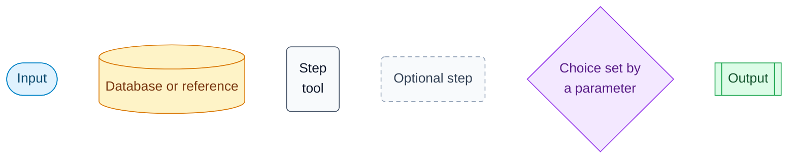
```mermaid
flowchart LR
    a(["Input"]):::input
    b[("Database or reference")]:::db
    c("Step<br/>tool"):::step
    d("Optional step"):::optional
    e{"Choice set by<br/>a parameter"}:::choice
    f[["Output"]]:::output
    a ~~~ b ~~~ c ~~~ d ~~~ e ~~~ f

    classDef input fill:#e0f2fe,stroke:#0284c7,color:#0c4a6e
    classDef db fill:#fef3c7,stroke:#d97706,color:#78350f
    classDef step fill:#f8fafc,stroke:#475569,color:#0f172a
    classDef optional fill:#f8fafc,stroke:#94a3b8,color:#334155,stroke-dasharray:5 4
    classDef choice fill:#f3e8ff,stroke:#9333ea,color:#581c87
    classDef output fill:#dcfce7,stroke:#16a34a,color:#14532d
```

Dashed arrows lead to optional steps or optional inputs.

------

### quality_control

#### Description

This pipeline performs quality control on raw sequencing data using fastp. It takes paired-end reads as input and generates quality-controlled reads as output. The workflow includes the following steps:

1. **Quality Control with fastp**: The raw sequencing reads are processed using fastp to remove low-quality reads and adapters. The output is a set of quality-controlled reads.

2. **Host Decontamination**: The quality-controlled reads are then decontaminated using a reference host genome. This step removes any reads that map to the host genome, resulting in a set of cleaned reads.

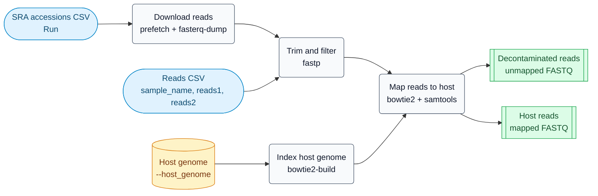
```mermaid
flowchart LR
    csv(["Reads CSV<br/>sample_name, reads1, reads2"]):::input
    sra(["SRA accessions CSV<br/>Run"]):::input
    host[("Host genome<br/>--host_genome")]:::db
    dl("Download reads<br/>prefetch + fasterq-dump"):::step
    fastp("Trim and filter<br/>fastp"):::step
    idx("Index host genome<br/>bowtie2-build"):::step
    map("Map reads to host<br/>bowtie2 + samtools"):::step
    clean[["Decontaminated reads<br/>unmapped FASTQ"]]:::output
    hostreads[["Host reads<br/>mapped FASTQ"]]:::output

    sra --> dl --> fastp
    csv --> fastp
    fastp --> map
    host --> idx --> map
    map --> clean
    map --> hostreads

    classDef input fill:#e0f2fe,stroke:#0284c7,color:#0c4a6e
    classDef db fill:#fef3c7,stroke:#d97706,color:#78350f
    classDef step fill:#f8fafc,stroke:#475569,color:#0f172a
    classDef optional fill:#f8fafc,stroke:#94a3b8,color:#334155,stroke-dasharray:5 4
    classDef choice fill:#f3e8ff,stroke:#9333ea,color:#581c87
    classDef output fill:#dcfce7,stroke:#16a34a,color:#14532d
```

#### How to run

Multiple samples can be processed in parallel with nextflow. Quality control workflow needs three inputs:

- sample_name

- reads

- host_genome

Currently there are two ways to run this pipeline:

- **local**: You have the samples locally in the execution environment. In this case, you need to provide a csv file containing at least three columns:

- sample_name

- reads1

- reads2

Also you need to provide the path to the host genome. An example run with this mode looks like this:

```bash
nextflow run pipelines.nf --roadmap_id quality_control --host_genome "raw_data/ref_genome.fa" --input_type "local" --input_file <path-to-csv-files> -profile apptainer,alpine
```
**NOTE** You should change the config file according to your environment.

- **sra**: In this case you only need a CSV file describig the accession id of your runs:

- Run

 An example run with this mode looks like this:

```bash
nextflow run pipelines.nf --roadmap_id quality_control --host_genome "raw_data/ref_genome.fa" --input_type "sra" --input_file <path-to-csv-files> -profile apptainer,alpine
```

### roadmap_1

#### Description

This roadmap is designed to perform metagenomics analysis using a de novo assembly approach. The workflow starts with **quality-controlled** sequencing data and performs the following steps:

1. **De Novo Assembly**: The cleaned reads are then assembled into contigs using MEGAHIT.

2. **Binning**: The assembled contigs are binned into metagenome-assembled genomes (MAGs) using MetaBAT2.

**NOTE**: This roadmap specifically does not include functional or taxonomic annotation of the bins. Those are delegated to other roadmaps.

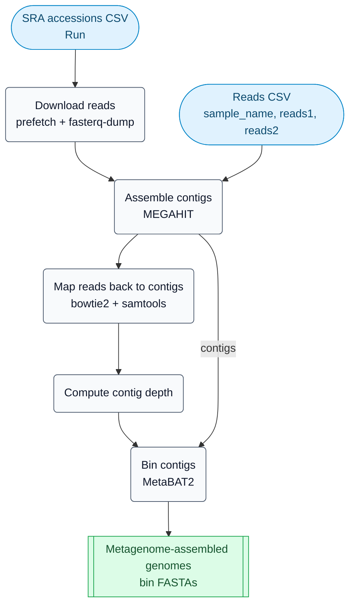
```mermaid
flowchart TB
    csv(["Reads CSV<br/>sample_name, reads1, reads2"]):::input
    sra(["SRA accessions CSV<br/>Run"]):::input
    dl("Download reads<br/>prefetch + fasterq-dump"):::step
    asm("Assemble contigs<br/>MEGAHIT"):::step
    map("Map reads back to contigs<br/>bowtie2 + samtools"):::step
    cov("Compute contig depth"):::step
    bin("Bin contigs<br/>MetaBAT2"):::step
    mags[["Metagenome-assembled genomes<br/>bin FASTAs"]]:::output

    sra --> dl --> asm
    csv --> asm
    asm --> map --> cov --> bin --> mags
    asm -- "contigs" --> bin

    classDef input fill:#e0f2fe,stroke:#0284c7,color:#0c4a6e
    classDef db fill:#fef3c7,stroke:#d97706,color:#78350f
    classDef step fill:#f8fafc,stroke:#475569,color:#0f172a
    classDef optional fill:#f8fafc,stroke:#94a3b8,color:#334155,stroke-dasharray:5 4
    classDef choice fill:#f3e8ff,stroke:#9333ea,color:#581c87
    classDef output fill:#dcfce7,stroke:#16a34a,color:#14532d
```

#### How to run

Multiple samples can be processed in parallel with nextflow. Roadmap1 workflow needs three inputs:

- sample_name

- reads

Currently there are three ways to run this roadmap:

- **local**: You have the samples locally in the execution environment. In this case, you need to provide a csv file containing at least three columns:

- sample_name

- reads1

- reads2

Also you need to provide the path to the host genome. An example run with this mode looks like this:

```bash
nextflow run pipelines.nf --roadmap roadmap_1 --input_type "local" --input_file <path-to-csv-files> -profile apptainer,alpine
```

**NOTE** You should change the config file according to your environment. 

- **sra**: In this case you only need a CSV file describig the accession id of your runs:

- Run

An example run with this mode looks like this:

```bash
nextflow run pipelines.nf --roadmap_id roadmap_1 --host_genome "raw_data/ref_genome.fa"--input_type "sra" --input_file <path-to-csv-files> -profile apptainer,alpine
```

### roadmap_2

#### Description

This roadmap is designed to perform strain-level analysis using inStrain. You can provide paired-end reads or pre-aligned BAM files together with the genomes to profile. The workflow starts with the following steps:

1. **Concatenating the Genomes**: The genomes are concatenated into one fasta file to run inStrain in database mode.
2. **Aligning the reads to the concatenated fasta file** : If reads are provided, they are aligned to the concatenated fasta file using bowtie2. This step generates a sorted BAM file for each sample. If BAM files are provided directly, this alignment step is skipped.
3. **Profile each Sample**: Each sample is profiled against the concatenated fasta file using inStrain. This step generates a profile for each sample.
4. **Compare the Profiles**: The profiles are compared using inStrain compare. This step generates a comparison file for each sample.

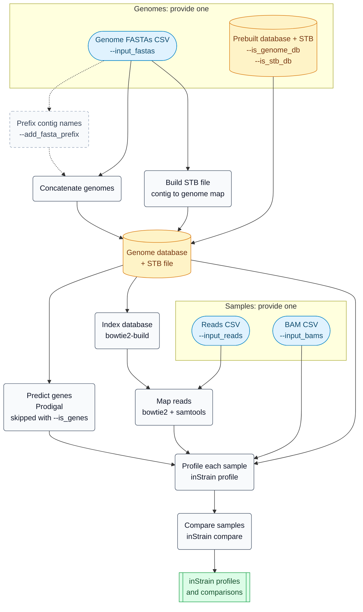
```mermaid
flowchart TB
    subgraph genomes_in ["Genomes: provide one"]
        direction LR
        fastas(["Genome FASTAs CSV<br/>--input_fastas"]):::input
        prebuilt[("Prebuilt database + STB<br/>--is_genome_db<br/>--is_stb_db")]:::db
    end
    subgraph samples_in ["Samples: provide one"]
        direction LR
        reads(["Reads CSV<br/>--input_reads"]):::input
        bams(["BAM CSV<br/>--input_bams"]):::input
    end

    prefix("Prefix contig names<br/>--add_fasta_prefix"):::optional
    concat("Concatenate genomes"):::step
    stb("Build STB file<br/>contig to genome map"):::step
    db[("Genome database<br/>+ STB file")]:::db
    genes("Predict genes<br/>Prodigal<br/>skipped with --is_genes"):::step
    idx("Index database<br/>bowtie2-build"):::step
    map("Map reads<br/>bowtie2 + samtools"):::step
    profile("Profile each sample<br/>inStrain profile"):::step
    compare("Compare samples<br/>inStrain compare"):::step
    out[["inStrain profiles<br/>and comparisons"]]:::output

    fastas -.-> prefix -.-> concat
    fastas --> concat --> db
    fastas --> stb --> db
    prebuilt --> db
    db --> genes --> profile
    db --> idx --> map
    reads --> map --> profile
    bams --> profile
    db --> profile
    profile --> compare --> out

    classDef input fill:#e0f2fe,stroke:#0284c7,color:#0c4a6e
    classDef db fill:#fef3c7,stroke:#d97706,color:#78350f
    classDef step fill:#f8fafc,stroke:#475569,color:#0f172a
    classDef optional fill:#f8fafc,stroke:#94a3b8,color:#334155,stroke-dasharray:5 4
    classDef choice fill:#f3e8ff,stroke:#9333ea,color:#581c87
    classDef output fill:#dcfce7,stroke:#16a34a,color:#14532d
```

#### How to run

Currently there are three ways to run this roadmap:

1- You have prepared your concatenated genomes database and you have a STB file ready. 

- **samples.csv**: This file should contain the following columns:

- sample_name

- reads1

- reads2

- **stb file**: stb file is a text file made with a script accompanying dRep. Check the inStrain and dRep documentation for more information. It contains the mapping between contigs and genomes.

- **genome database**: This is a fasta file containing all the genomes you want to compare merged in one file. You can run the roadmap using the following command

If you want to use the first option, you use this roadmap like this:

```bash
nextflow run pipelines.nf --roadmap_id "roadmap_2" --input_reads "<path-to-samples.csv"  --is_genome_db <path-to-genome-database> --is_stb_db <path-to-stb-file> -profile apptainer,alpine
```

2- You have a list of samples and genomes and you want to make the genome database and the stb files using the pipeline.

In this case, you need to provide two CSV files:

- **samples.csv**: This file should contain the following columns:
- sample_name
- reads1
- reads2

- **genomes.csv**: This file should contain one column:
    - fasta_files (address to each fasta file)

If you want to choose the second option, you can run the roadmap using the following command:

```bash
nextflow run pipelines.nf --roadmap_id "roadmap_2" --input_reads "<path-to-samples.csv>" --input_fastas "<path-to-genomes.csv>" -profile apptainer,alpine
```

3- You already have BAM files aligned to the same genome database and want to run inStrain directly on those BAM files.

In this case, you provide `--input_bams` instead of `--input_reads`. The BAM files are passed directly to `inStrain profile`, so roadmap_2 skips the Bowtie2 alignment step.

You still provide a `samples.csv` file with the following columns:

- sample_name
- bam_files

For example, if you already have the genome database and STB file:

```bash
nextflow run pipelines.nf --roadmap_id "roadmap_2" --input_bams "<path-to-samples.csv>" --is_genome_db <path-to-genome-database> --is_stb_db <path-to-stb-file> -profile apptainer,alpine

```

Make sure the BAM files were aligned against the same reference database used for `--is_genome_db` or generated from `--input_fastas`, and that the contig names match.

##### Optional arguments

- **--is_genes**: If you already have the genes of your input fasta(s) you can provide the path to the genes file. Otherwise, the genes will be extracted from the input fasta(s) using prodigal.

**NOTE** You should change the config file according to your environment.

------

### roadmap_3

#### Description

This roadmap is designed to perform dereplication on a set of provided genomes. The workflow starts with the following steps:

1. **writing the genomes to a text file**: Avoids command line length issues.

2. **Dereplicating the genomes**: The genomes are dereplicated using dRep.


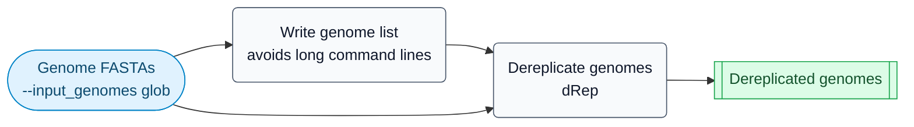
```mermaid
flowchart LR
    genomes(["Genome FASTAs<br/>--input_genomes glob"]):::input
    list("Write genome list<br/>avoids long command lines"):::step
    drep("Dereplicate genomes<br/>dRep"):::step
    out[["Dereplicated genomes"]]:::output

    genomes --> list --> drep --> out
    genomes --> drep

    classDef input fill:#e0f2fe,stroke:#0284c7,color:#0c4a6e
    classDef db fill:#fef3c7,stroke:#d97706,color:#78350f
    classDef step fill:#f8fafc,stroke:#475569,color:#0f172a
    classDef optional fill:#f8fafc,stroke:#94a3b8,color:#334155,stroke-dasharray:5 4
    classDef choice fill:#f3e8ff,stroke:#9333ea,color:#581c87
    classDef output fill:#dcfce7,stroke:#16a34a,color:#14532d
```

#### How to run

So far, the only way to run this roadmap is to provide glob address to the genomes. The genomes should be in fasta format. You can run the roadmap using the following command:

```bash
nextflow run pipelines.nf --roadmap_id "roadmap_3" --input_genomes "<path-to-genomes>" -profile apptainer,alpine 
```

**NOTES**

- You should change the profiles according to your environment. 

- The input_genomes should be a glob address to the genomes. For example, if you have a folder named "genomes" containing all the genomes, you can use "genomes/*.fasta" as the input_genomes.

- It is important to know that checkm saves the temporary files by default to $TMPDIR. If the workspace you are working in does not provide enough space in /tmp try doing `export TMPDIR=<PATH_TO_SOMEWHERE_WITH_ENOUGH_SPACE>

### roadmap_1_3_2

#### Description

This roadmap provides end-to-end analysis of a set of samples. It extracts the bins using roadmap_1, dereplicates the genomes using roadmap_3, and then performs strain-level analysis using roadmap_2. The workflow starts with the following steps:

1. **Extracting the bins**: The raw sequencing data is first subjected to quality control using fastp. Next using a reference genome, the reads are decontaminated. The cleaned reads are then assembled into contigs using MEGAHIT. The assembled contigs are binned into metagenome-assembled genomes (MAGs) using MetaBAT2.

2. **Dereplicating the genomes**: The bins are dereplicated using dRep.

3. **Strain-level analysis**: The genomes are combined to make one fasta file. The reads are aligned to the genomes using bowtie2. inStrain is then used to profile the reads against the fasta files. Finally, the profiles are compared using inStrain compare.

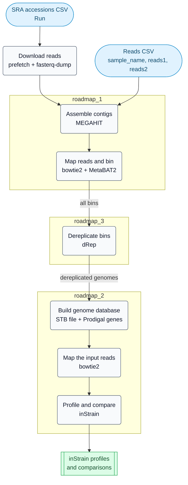
```mermaid
flowchart TB
    csv(["Reads CSV<br/>sample_name, reads1, reads2"]):::input
    sra(["SRA accessions CSV<br/>Run"]):::input
    dl("Download reads<br/>prefetch + fasterq-dump"):::step

    subgraph r1 ["roadmap_1"]
        direction LR
        asm("Assemble contigs<br/>MEGAHIT"):::step
        bin("Map reads and bin<br/>bowtie2 + MetaBAT2"):::step
        asm --> bin
    end
    subgraph r3 ["roadmap_3"]
        drep("Dereplicate bins<br/>dRep"):::step
    end
    subgraph r2 ["roadmap_2"]
        direction LR
        db("Build genome database<br/>STB file + Prodigal genes"):::step
        map("Map the input reads<br/>bowtie2"):::step
        prof("Profile and compare<br/>inStrain"):::step
        db --> map --> prof
    end
    out[["inStrain profiles<br/>and comparisons"]]:::output

    sra --> dl --> asm
    csv --> asm
    bin -- "all bins" --> drep
    drep -- "dereplicated genomes" --> db
    prof --> out

    classDef input fill:#e0f2fe,stroke:#0284c7,color:#0c4a6e
    classDef db fill:#fef3c7,stroke:#d97706,color:#78350f
    classDef step fill:#f8fafc,stroke:#475569,color:#0f172a
    classDef optional fill:#f8fafc,stroke:#94a3b8,color:#334155,stroke-dasharray:5 4
    classDef choice fill:#f3e8ff,stroke:#9333ea,color:#581c87
    classDef output fill:#dcfce7,stroke:#16a34a,color:#14532d
```

#### How to run

This roadmap has identical input to roadmap_1. You can either provide a CSV file containing the sample names and reads or a CSV file containing the accession ids of the samples. The host genome is also required. You can run the roadmap using the following command:

```bash
nextflow run pipelines.nf --roadmap_id "roadmap_1_3_2" --host_genome "<path-to-host-genome>" --input_type "local" --input_file <path-to-csv-files> -profile apptainer,alpine 
```

**NOTES** 

-   You should change the profile according to your environment. 
-   The input_file should be a CSV file containing the sample names and reads or a CSV file containing the accession ids of the samples. 
-   The host genome is also required.

------

### roadmap_4

#### Description

This roadmap is a subset of roadmap_1. It is designed to QC the reads and decontaminate them using a reference genome. The workflow starts with the following steps


```mermaid
flowchart LR
    csv(["Reads CSV<br/>sample_name, reads1, reads2"]):::input
    sra(["SRA accessions CSV<br/>Run"]):::input
    host[("Host genome<br/>--host_genome")]:::db
    dl("Download reads<br/>prefetch + fasterq-dump"):::step
    fastp("Trim and filter<br/>fastp"):::step
    idx("Index host genome<br/>bowtie2-build"):::step
    map("Map reads to host<br/>bowtie2 + samtools"):::step
    clean[["Decontaminated reads<br/>unmapped FASTQ"]]:::output
    hostreads[["Host reads<br/>mapped FASTQ"]]:::output

    sra --> dl --> fastp
    csv --> fastp
    fastp --> map
    host --> idx --> map
    map --> clean
    map --> hostreads

    classDef input fill:#e0f2fe,stroke:#0284c7,color:#0c4a6e
    classDef db fill:#fef3c7,stroke:#d97706,color:#78350f
    classDef step fill:#f8fafc,stroke:#475569,color:#0f172a
    classDef optional fill:#f8fafc,stroke:#94a3b8,color:#334155,stroke-dasharray:5 4
    classDef choice fill:#f3e8ff,stroke:#9333ea,color:#581c87
    classDef output fill:#dcfce7,stroke:#16a34a,color:#14532d
```

#### How to run

Similar to roadmap_1, there are two ways to run this roadmap:

- **local**: You have the samples locally in the execution environment. In this case, you need to provide a csv file containing at least three columns:

    - sample_name
    - reads1
    - reads2

Also you need to provide the path to the host genome. An example run with this mode looks like this:

```bash
nextflow run pipelines.nf --roadmap roadmap_4 --host_genome "raw_data/ref_genome.fa" --input_type "local" --input_file <path-to-csv-files> -profile apptainer,alpine 
```

**NOTES**

- You should change the config file according to your environment. 

- **sra**: In this case you only need a CSV file describing the accession id of your runs:

    - Run

An example run with this mode looks like this:

```bash
nextflow run pipelines.nf --roadmap roadmap_4 --host_genome "<path-to-reference-genome-fasta" --input_type "sra" --input_file <path-to-csv-files> -profile apptainer,alpine
```

------

### roadmap_3_2

#### Description

This roadmap first dereplicates a list of input genomes and then performs strain-level analysis using inStrain for the input reads. This roadmapcan be helpful for users who want to perform comparative genomics on closely related genomes. The workflow starts with the following steps:

1. **Dereplicating the genomes**: The genomes are dereplicated using dRep.
2. **Aligning the reads to the concatenated fasta file** : The reads are aligned to the concatenated fasta file using bowtie2. This step generates sorted BAM file for each sample.
3. **Profile each Sample**: Each sample is profiled against the concatenated fasta file using inStrain. This step generates a profile for each sample.
4. **Compare the Profiles**: The profiles are compared using inStrain compare. This step generates a comparison file for each sample.

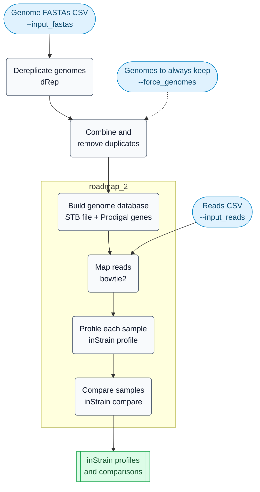
```mermaid
flowchart TB
    fastas(["Genome FASTAs CSV<br/>--input_fastas"]):::input
    force(["Genomes to always keep<br/>--force_genomes"]):::input
    reads(["Reads CSV<br/>--input_reads"]):::input
    drep("Dereplicate genomes<br/>dRep"):::step
    merge("Combine and<br/>remove duplicates"):::step

    subgraph r2 ["roadmap_2"]
        direction LR
        db("Build genome database<br/>STB file + Prodigal genes"):::step
        map("Map reads<br/>bowtie2"):::step
        prof("Profile each sample<br/>inStrain profile"):::step
        cmp("Compare samples<br/>inStrain compare"):::step
        db --> map --> prof --> cmp
    end
    out[["inStrain profiles<br/>and comparisons"]]:::output

    fastas --> drep --> merge
    force -.-> merge
    merge --> db
    reads --> map
    cmp --> out

    classDef input fill:#e0f2fe,stroke:#0284c7,color:#0c4a6e
    classDef db fill:#fef3c7,stroke:#d97706,color:#78350f
    classDef step fill:#f8fafc,stroke:#475569,color:#0f172a
    classDef optional fill:#f8fafc,stroke:#94a3b8,color:#334155,stroke-dasharray:5 4
    classDef choice fill:#f3e8ff,stroke:#9333ea,color:#581c87
    classDef output fill:#dcfce7,stroke:#16a34a,color:#14532d
```

#### How to run

To run this roadmap, you need to provide a CSV file containing the following columns:

- sample_name
- reads1
- reads2

Also, you need to provide a CSV file containing the paths to the genomes you want to dereplicate. This file should contain one column:

- fasta_files (address to each fasta file)

You can run the roadmap using the following command:

```bash
nextflow run pipelines.nf --roadmap_id "roadmap_3_2" --input_reads "<path-to-samples.csv>" --input_fastas "<path-to-genomes.csv>" -profile apptainer,alpine
```

##### Relevant optional arguments

- **--drep_s_ani** : The average nucleotide identity threshold for dereplication. Default is 0.95

- **--drep_extra_weight_table**: path to a tab separated text file that assignes extra weights to genomes. something like this:

```
genome1  2
```

Usually this option is used to prioritize specific genomes.

------

### roadmap_5

#### Description

This roadmap maps a set of reads to a set of reference genomes and outputs a BAM file per sample/genome pair. It supports both **short reads** (Illumina, via Bowtie2) and **long reads** (Oxford Nanopore or PacBio, via minimap2).

Two pairing modes are available:

1. **paired** (default): Each sample is aligned to its corresponding genome (1-to-1 pairing; the CSV row order must match).
2. **cross**: Each sample is aligned to every genome in the reference set.

**BAM output behaviour:**

By default, the output BAM contains **mapped reads only**. This is the most common use case and avoids large output files. Use the flags below to change this:

| Flag | Effect |
|------|--------|
| *(none — default)* | Mapped-only BAM |
| `--keep_unmapped_reads` | Full BAM (mapped + unmapped reads retained) |
| `--get_mapped_reads` | Also produce a FASTQ of mapped reads |
| `--get_unmapped_reads` | Also produce a FASTQ of unmapped reads |

`--get_mapped_reads` and `--get_unmapped_reads` can be combined and are independent of `--keep_unmapped_reads`.

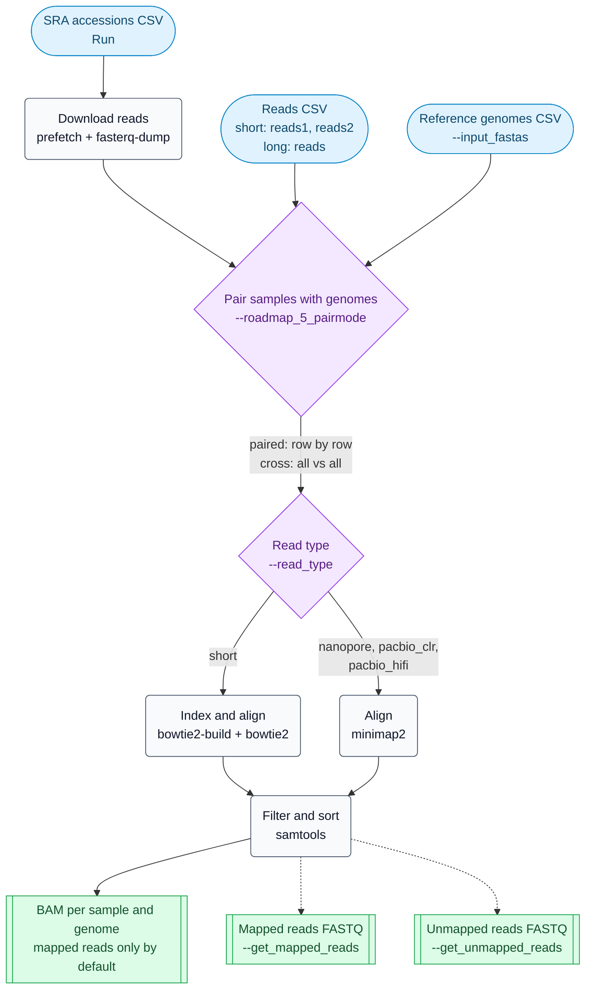
```mermaid
flowchart TB
    csv(["Reads CSV<br/>short: reads1, reads2<br/>long: reads"]):::input
    sra(["SRA accessions CSV<br/>Run"]):::input
    fastas(["Reference genomes CSV<br/>--input_fastas"]):::input
    dl("Download reads<br/>prefetch + fasterq-dump"):::step
    pair{"Pair samples with genomes<br/>--roadmap_5_pairmode"}:::choice
    type{"Read type<br/>--read_type"}:::choice
    short("Index and align<br/>bowtie2-build + bowtie2"):::step
    long("Align<br/>minimap2"):::step
    sort("Filter and sort<br/>samtools"):::step
    bam[["BAM per sample and genome<br/>mapped reads only by default"]]:::output
    mfq[["Mapped reads FASTQ<br/>--get_mapped_reads"]]:::output
    ufq[["Unmapped reads FASTQ<br/>--get_unmapped_reads"]]:::output

    sra --> dl --> pair
    csv --> pair
    fastas --> pair
    pair -- "paired: row by row<br/>cross: all vs all" --> type
    type -- "short" --> short --> sort
    type -- "nanopore, pacbio_clr,<br/>pacbio_hifi" --> long --> sort
    sort --> bam
    sort -.-> mfq
    sort -.-> ufq

    classDef input fill:#e0f2fe,stroke:#0284c7,color:#0c4a6e
    classDef db fill:#fef3c7,stroke:#d97706,color:#78350f
    classDef step fill:#f8fafc,stroke:#475569,color:#0f172a
    classDef optional fill:#f8fafc,stroke:#94a3b8,color:#334155,stroke-dasharray:5 4
    classDef choice fill:#f3e8ff,stroke:#9333ea,color:#581c87
    classDef output fill:#dcfce7,stroke:#16a34a,color:#14532d
```

#### How to run — short reads (default)

**Local input**: Provide a CSV with the following columns:

- `sample_name`
- `reads1`
- `reads2`

```bash
nextflow run pipelines.nf --roadmap_id "roadmap_5" \
    --input_type local \
    --input_reads "<path-to-samples.csv>" \
    --input_fastas "<path-to-genomes.csv>" \
    -profile apptainer,alpine
```

**SRA input**: Provide a CSV with a single column:

- `Run` (SRA accession ID, e.g. `SRR12345678`)

```bash
nextflow run pipelines.nf --roadmap_id "roadmap_5" \
    --input_type sra \
    --input_reads "<path-to-sra-accessions.csv>" \
    --input_fastas "<path-to-genomes.csv>" \
    -profile apptainer,alpine
```

In both cases, a genome CSV with one column is required:

- `fasta_files`

#### How to run — long reads (Nanopore / PacBio)

> **Important**: Long-read mode uses a **different CSV format** from short reads. This is intentional — long reads are single-end and require careful validation before running.

Pass `--read_type` to select the sequencing technology. This controls the minimap2 preset:

| `--read_type` | Technology | minimap2 preset |
|---|---|---|
| `nanopore` | Oxford Nanopore (ONT) | `map-ont` |
| `pacbio_clr` | PacBio CLR (continuous long reads) | `map-pb` |
| `pacbio_hifi` | PacBio HiFi / CCS (high-accuracy) | `map-hifi` |

**Local input**: Provide a CSV with the following columns:

- `sample_name`
- `reads` *(single FASTQ file per sample — do **not** use `reads1`/`reads2`)*

```bash
nextflow run pipelines.nf --roadmap_id "roadmap_5" \
    --read_type nanopore \
    --input_type local \
    --input_reads "<path-to-long-reads.csv>" \
    --input_fastas "<path-to-genomes.csv>" \
    -profile apptainer,alpine
```

**SRA input**: Provide a CSV with a single column:

- `Run` (SRA accession ID, e.g. `SRR12345678`)

```bash
nextflow run pipelines.nf --roadmap_id "roadmap_5" \
    --read_type nanopore \
    --input_type sra \
    --input_reads "<path-to-sra-accessions.csv>" \
    --input_fastas "<path-to-genomes.csv>" \
    -profile apptainer,alpine
```

In both cases, a genome CSV with one column is required:

- `fasta_files`

#### Example: keep full BAM and extract unmapped reads as FASTQ

```bash
nextflow run pipelines.nf --roadmap_id "roadmap_5" \
    --input_reads "<path-to-samples.csv>" \
    --input_fastas "<path-to-genomes.csv>" \
    --keep_unmapped_reads \
    --get_unmapped_reads \
    -profile apptainer,alpine
```

##### Relevant optional arguments

- **--input_type** : Input mode. `local` (default) or `sra`. For SRA mode the input CSV must have a `Run` column with accession IDs.
- **--read_type** : Sequencing technology. One of `short` (default), `nanopore`, `pacbio_clr`, `pacbio_hifi`.
- **--roadmap_5_pairmode** : Pairing mode. `paired` (default) or `cross`.
- **--keep_unmapped_reads** : Retain unmapped reads in the output BAM (default: mapped-only BAM).
- **--get_mapped_reads** : Additionally write a FASTQ file of mapped reads.
- **--get_unmapped_reads** : Additionally write a FASTQ file of unmapped reads.

------

### roadmap_6

#### Description

This roadmap is designed to perform metagenomics analysis using a reference-based approach. It starts with raw sequencing data and performs the following steps:

1. **Estimate abundance with Sylph**: By default, GTDB is used as the reference database. 
2. **Estimate abundance with Metaphlan**: This will run Metaphlan to estimate the abundance of taxa in the samples.
3. **Classify reads and estimate abundance with KRAKEN2 and BRACKEN**: This will run KRAKEN2 to classify the reads and estimate the abundance of taxa in the samples.
4. **Estimate functional profile of the samples with HUMAnN**: This will run HUMAnN3 to estimate the functional profile of the samples.

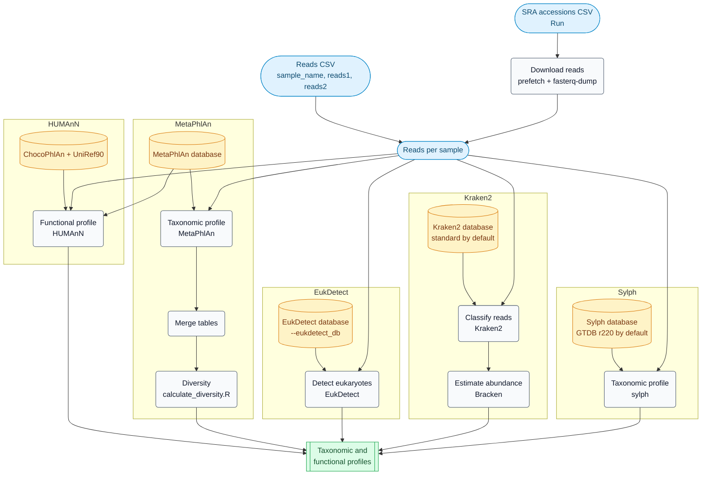
```mermaid
flowchart TB
    csv(["Reads CSV<br/>sample_name, reads1, reads2"]):::input
    sra(["SRA accessions CSV<br/>Run"]):::input
    dl("Download reads<br/>prefetch + fasterq-dump"):::step
    samples(["Reads per sample"]):::input
    sra --> dl --> samples
    csv --> samples

    subgraph sylph_sg ["Sylph"]
        direction TB
        sylph_db[("Sylph database<br/>GTDB r220 by default")]:::db
        sylph("Taxonomic profile<br/>sylph"):::step
        sylph_db --> sylph
    end
    subgraph mpa_sg ["MetaPhlAn"]
        direction TB
        mpa_db[("MetaPhlAn database")]:::db
        mpa("Taxonomic profile<br/>MetaPhlAn"):::step
        mpa_merge("Merge tables"):::step
        mpa_div("Diversity<br/>calculate_diversity.R"):::step
        mpa_db --> mpa --> mpa_merge --> mpa_div
    end
    subgraph kraken_sg ["Kraken2"]
        direction TB
        kraken_db[("Kraken2 database<br/>standard by default")]:::db
        kraken("Classify reads<br/>Kraken2"):::step
        bracken("Estimate abundance<br/>Bracken"):::step
        kraken_db --> kraken --> bracken
    end
    subgraph humann_sg ["HUMAnN"]
        direction TB
        humann_db[("ChocoPhlAn + UniRef90")]:::db
        humann("Functional profile<br/>HUMAnN"):::step
        humann_db --> humann
    end
    subgraph euk_sg ["EukDetect"]
        direction TB
        euk_db[("EukDetect database<br/>--eukdetect_db")]:::db
        euk("Detect eukaryotes<br/>EukDetect"):::step
        euk_db --> euk
    end
    out[["Taxonomic and<br/>functional profiles"]]:::output

    samples --> sylph
    samples --> mpa
    samples --> kraken
    samples --> humann
    samples --> euk
    mpa_db --> humann
    sylph --> out
    mpa_div --> out
    bracken --> out
    humann --> out
    euk --> out

    classDef input fill:#e0f2fe,stroke:#0284c7,color:#0c4a6e
    classDef db fill:#fef3c7,stroke:#d97706,color:#78350f
    classDef step fill:#f8fafc,stroke:#475569,color:#0f172a
    classDef optional fill:#f8fafc,stroke:#94a3b8,color:#334155,stroke-dasharray:5 4
    classDef choice fill:#f3e8ff,stroke:#9333ea,color:#581c87
    classDef output fill:#dcfce7,stroke:#16a34a,color:#14532d
```

Each tool can be skipped with `--exclude_sylph`, `--exclude_metaphlan`, `--exclude_kraken`, `--exclude_humann` or `--exclude_eukdetect`. Databases you don't pass as parameters are downloaded automatically, except the EukDetect database, which must be given with `--eukdetect_db`.

#### How to run

To run this roadmap, you need to provide a CSV file containing the following columns:

- sample_name
- reads1
- reads2

You can run the roadmap using the following command:

```bash
nextflow run pipelines.nf --roadmap_id "roadmap_6" --input_file "<path-to-samples.csv>" -profile apptainer,alpine
```

##### Relevant optional arguments

- **--sylph_db** : Path to the Sylph database. If this is not provided, the default GTDB database will be used. NOTE: you should directly provide the path to the Sylph database **file** ending in syldb.

- **--sylph_db_link**: If you want to download the Sylph database from a specific link, you can provide the link here. 

- **--metaphlan_db** path to the Metaphlan database. If this is not provided, the default Metaphlan database will be downloaded. NOTE: you should provide the **directory** containing the Metaphlan database ending in metaphlan

- **--kraken2_db** path to the KRAKEN2 database. If this is not provided, the standard KRAKEN2 database will be downloaded. NOTE: Similar to the Metaphlan database, you should provide the **directory** containing the KRAKEN2 database ending in kraken2

- **--humann_chocophlan** path to the Chocophlan database. If this is not provided, the default Chocophlan database will be downloaded. NOTE: Similar to the Metaphlan database, you should provide the **directory** containing the Chocophlan database ending in chocophlan

- **--humann_uniref** path to the Uniref database. If this is not provided, the default Uniref database will be downloaded. NOTE: Similar to the Metaphlan database, you should provide the **directory** containing the Uniref database ending in uniref

- **--metaphlan_b_distance**: type of distance metric to use for Metaphlan beta diversity analysis. 

- **--metaphlan_diversity**: type of diversity metric to use for Metaphlan diversity analysis. Default is beta diversity.

- **--metaphlan_db**: Path to the Metaphlan database. If this is not provided, it will be downloaded automatically.

- **--exclude_sylph**: If you want to exclude Sylph from the analysis, you can provide this argument. 

- **--exclude_metaphlan**: If you want to exclude Metaphlan from the analysis, you can provide this argument.

- **--exclude_kraken**: If you want to exclude KRAKEN2 from the analysis, you can provide this argument.

- **--exclude_humann**: If you want to exclude HUMAnN from the analysis, you can provide this argument.

------

### roadmap_7

#### Description

This roadmap is designed to do both taxonomic and functional annotation of a set of genomes. It starts with a set of genomes and performs the following steps:

1. **Taxonomic annotation with GTDB**: The genomes are annotated using GTDB.
2. **Functional annotation**: UNDER CUSTRUCTION

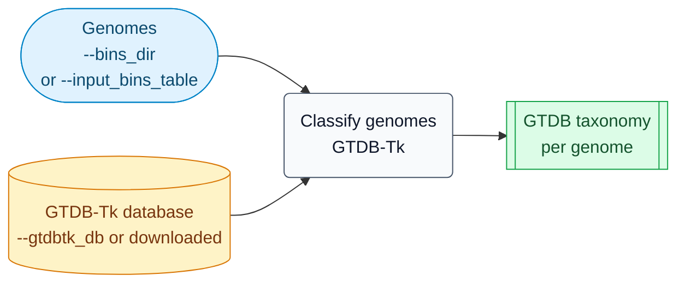
```mermaid
flowchart LR
    bins(["Genomes<br/>--bins_dir<br/>or --input_bins_table"]):::input
    db[("GTDB-Tk database<br/>--gtdbtk_db or downloaded")]:::db
    gtdb("Classify genomes<br/>GTDB-Tk"):::step
    out[["GTDB taxonomy<br/>per genome"]]:::output

    bins --> gtdb
    db --> gtdb
    gtdb --> out

    classDef input fill:#e0f2fe,stroke:#0284c7,color:#0c4a6e
    classDef db fill:#fef3c7,stroke:#d97706,color:#78350f
    classDef step fill:#f8fafc,stroke:#475569,color:#0f172a
    classDef optional fill:#f8fafc,stroke:#94a3b8,color:#334155,stroke-dasharray:5 4
    classDef choice fill:#f3e8ff,stroke:#9333ea,color:#581c87
    classDef output fill:#dcfce7,stroke:#16a34a,color:#14532d
```

#### How to run

To run this roadmap, you need to provide either path to the genomes or a CSV file containing the paths to the genomes you want to annotate. This file should contain one column:

- fasta_files (address to each fasta file)

You can run the roadmap using the following commands:

```bash
nextflow run pipelines.nf --roadmap_id "roadmap_7" --bins_dir "<path-to-genomes>" -profile apptainer,alpine
```

or 

```bash
nextflow run pipelines.nf --roadmap_id "roadmap_7" --input_bins_table "<path-to-genomes-table.csv>" -profile apptainer,alpine
```

##### Relevant optional arguments

- **--gtdbtk_db** : Path to the GTDB database. If this is not provided, the GTDB database will be downloaded.

------

### roadmap_8

#### Description

This roadmap is designed for RNA-Seq data. It supports:

1. **Bulk RNA-Seq**: runs read QC with fastp, STAR alignment, and featureCounts.
2. **Single-cell RNA-Seq with Kallisto/kb-python**: runs read QC, builds a Kallisto index from a genome FASTA and GTF, and produces an h5ad count matrix.
3. **Single-cell RNA-Seq with Cell Ranger**: stages paired 10x FASTQs using Cell Ranger-compatible names and runs `cellranger count` against a pre-built 10x reference.

Cell Ranger is commercial 10x Genomics software and is not bundled in the roadmap8 Docker image. To use it, provide the path to a licensed Cell Ranger installation directory with `--cellranger_path`. When running with a container profile, this path must be visible inside the container at runtime.

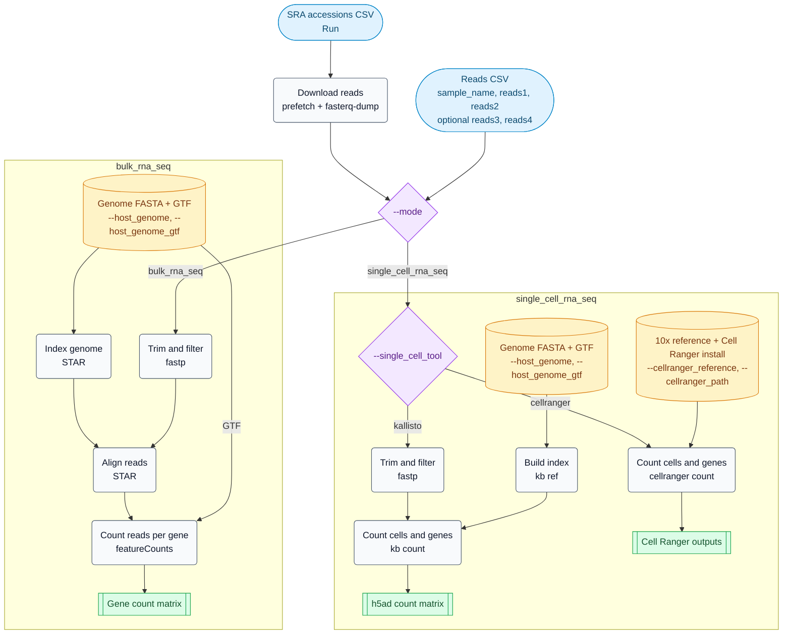
```mermaid
flowchart TB
    csv(["Reads CSV<br/>sample_name, reads1, reads2<br/>optional reads3, reads4"]):::input
    sra(["SRA accessions CSV<br/>Run"]):::input
    dl("Download reads<br/>prefetch + fasterq-dump"):::step
    mode{"--mode"}:::choice
    sra --> dl --> mode
    csv --> mode

    subgraph bulk ["bulk_rna_seq"]
        direction TB
        b_ref[("Genome FASTA + GTF<br/>--host_genome, --host_genome_gtf")]:::db
        b_qc("Trim and filter<br/>fastp"):::step
        b_idx("Index genome<br/>STAR"):::step
        b_aln("Align reads<br/>STAR"):::step
        b_cnt("Count reads per gene<br/>featureCounts"):::step
        b_out[["Gene count matrix"]]:::output
        b_ref --> b_idx --> b_aln
        b_qc --> b_aln --> b_cnt --> b_out
        b_ref -- "GTF" --> b_cnt
    end

    subgraph sc ["single_cell_rna_seq"]
        direction TB
        tool{"--single_cell_tool"}:::choice
        k_ref[("Genome FASTA + GTF<br/>--host_genome, --host_genome_gtf")]:::db
        k_qc("Trim and filter<br/>fastp"):::step
        k_idx("Build index<br/>kb ref"):::step
        k_cnt("Count cells and genes<br/>kb count"):::step
        k_out[["h5ad count matrix"]]:::output
        c_ref[("10x reference + Cell Ranger install<br/>--cellranger_reference, --cellranger_path")]:::db
        c_cnt("Count cells and genes<br/>cellranger count"):::step
        c_out[["Cell Ranger outputs"]]:::output
        tool -- "kallisto" --> k_qc --> k_cnt --> k_out
        k_ref --> k_idx --> k_cnt
        tool -- "cellranger" --> c_cnt --> c_out
        c_ref --> c_cnt
    end

    mode -- "bulk_rna_seq" --> b_qc
    mode -- "single_cell_rna_seq" --> tool

    classDef input fill:#e0f2fe,stroke:#0284c7,color:#0c4a6e
    classDef db fill:#fef3c7,stroke:#d97706,color:#78350f
    classDef step fill:#f8fafc,stroke:#475569,color:#0f172a
    classDef optional fill:#f8fafc,stroke:#94a3b8,color:#334155,stroke-dasharray:5 4
    classDef choice fill:#f3e8ff,stroke:#9333ea,color:#581c87
    classDef output fill:#dcfce7,stroke:#16a34a,color:#14532d
```

#### How to run

For local FASTQs, provide a CSV with:

- sample_name
- reads1
- reads2
- reads3 (optional Cell Ranger I1/index read)
- reads4 (optional Cell Ranger I2/index read)

For Cell Ranger, `reads1` must be the barcode/UMI read (R1), `reads2` must be the cDNA read (R2), and optional `reads3`/`reads4` are staged as index reads I1/I2. The workflow does not trim reads before Cell Ranger, because 10x barcode and UMI positions must be preserved.

For SRA input, provide a CSV with:

- Run

The SRA downloader emits all split FASTQs for the run. In the Cell Ranger branch, the first two files are staged as R1/R2 and optional third/fourth files are staged as I1/I2. For GEO records, use the linked SRA run accessions when available, or download GEO supplementary FASTQs and provide them with `--input_type local`.

Bulk RNA-Seq:

```bash
nextflow run pipelines.nf \
  --roadmap_id roadmap_8 \
  --mode bulk_rna_seq \
  --input_type local \
  --input_file samples.csv \
  --host_genome genome.fa \
  --host_genome_gtf genes.gtf \
  -profile apptainer,alpine
```

SRA input with Cell Ranger:

```bash
nextflow run pipelines.nf \
  --roadmap_id roadmap_8 \
  --mode single_cell_rna_seq \
  --single_cell_tool cellranger \
  --input_type sra \
  --input_file sra_runs.csv \
  --cellranger_reference /path/to/refdata-gex-GRCh38-2024-A \
  --cellranger_path /path/to/cellranger-10.0.0 \
  -profile local
```

Single-cell RNA-Seq with Kallisto:

```bash
nextflow run pipelines.nf \
  --roadmap_id roadmap_8 \
  --mode single_cell_rna_seq \
  --single_cell_tool kallisto \
  --input_type local \
  --input_file samples.csv \
  --host_genome genome.fa \
  --host_genome_gtf genes.gtf \
  -profile apptainer,alpine
```

Single-cell RNA-Seq with Cell Ranger:

```bash
nextflow run pipelines.nf \
  --roadmap_id roadmap_8 \
  --mode single_cell_rna_seq \
  --single_cell_tool cellranger \
  --input_type local \
  --input_file samples.csv \
  --cellranger_reference /path/to/refdata-gex-GRCh38-2024-A \
  --cellranger_path /path/to/cellranger-10.0.0 \
  -profile local
```

If you run with Docker or Apptainer, keep using the roadmap8 container for dependencies, but make sure the Cell Ranger installation directory path is mounted/visible inside the container:

```bash
nextflow run pipelines.nf \
  --roadmap_id roadmap_8 \
  --mode single_cell_rna_seq \
  --single_cell_tool cellranger \
  --input_type local \
  --input_file samples.csv \
  --cellranger_reference /path/to/refdata-gex-GRCh38-2024-A \
  --cellranger_path /path/visible/in/container/cellranger-10.0.0 \
  -profile docker
```

##### Relevant optional arguments

- **--single_cell_tool**: Single-cell engine. Options are `kallisto` and `cellranger`. Default is `kallisto`.
- **--cellranger_reference**: Path to a pre-built Cell Ranger reference directory, such as `refdata-gex-GRCh38-2024-A`.
- **--cellranger_path**: Path to the Cell Ranger installation directory. Required when `--single_cell_tool cellranger`.
- **--cellranger_include_introns**: Passed to `cellranger count --include-introns`. Default is `true`.
- **--cellranger_create_bam**: Passed to `cellranger count --create-bam`. Default is `true`.

------

### roadmap_9

#### Description

This roadmap is designed to detect circular RNA contigs from RNA-Seq data. The roadmap follows these steps:

1. **Assembly**: The RNA-Seq reads are assembled into contigs using rnaSpades.
2. **Circular Contig Detection**: The assembled contigs are analyzed to identify circular RNA structures. This is done using the cirit tool. 
3. **Mapping**: The identified circular contigs are mapped to a reference transcriptome using minimap2.

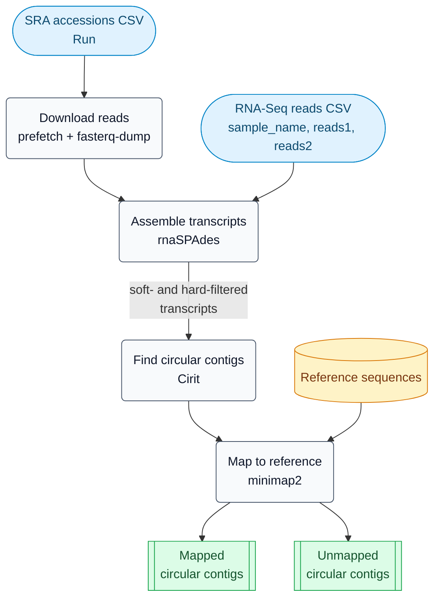
```mermaid
flowchart TB
    csv(["RNA-Seq reads CSV<br/>sample_name, reads1, reads2"]):::input
    sra(["SRA accessions CSV<br/>Run"]):::input
    ref[("Reference sequences")]:::db
    dl("Download reads<br/>prefetch + fasterq-dump"):::step
    asm("Assemble transcripts<br/>rnaSPAdes"):::step
    cirit("Find circular contigs<br/>Cirit"):::step
    map("Map to reference<br/>minimap2"):::step
    mapped[["Mapped<br/>circular contigs"]]:::output
    unmapped[["Unmapped<br/>circular contigs"]]:::output

    sra --> dl --> asm
    csv --> asm
    asm -- "soft- and hard-filtered<br/>transcripts" --> cirit --> map
    ref --> map
    map --> mapped
    map --> unmapped

    classDef input fill:#e0f2fe,stroke:#0284c7,color:#0c4a6e
    classDef db fill:#fef3c7,stroke:#d97706,color:#78350f
    classDef step fill:#f8fafc,stroke:#475569,color:#0f172a
    classDef optional fill:#f8fafc,stroke:#94a3b8,color:#334155,stroke-dasharray:5 4
    classDef choice fill:#f3e8ff,stroke:#9333ea,color:#581c87
    classDef output fill:#dcfce7,stroke:#16a34a,color:#14532d
```

#### How to run

Multiple samples can be processed in parallel with nextflow. Roadmap_9 workflow needs three inputs:

- sample_name
- reads
- reference_transcriptome (e.g. https://ftp.ebi.ac.uk/pub/databases/gencode/Gencode_human/release_48/)

Currently there are two ways to run this roadmap:

- **local**: You have the samples locally in the execution environment. In this case, you need to provide a csv file containing at least three columns:

    - sample_name
    - reads1
    - reads2

Also you need to provide the path to the reference transcriptome. An example run with this mode looks like this:

```bash
nextflow run pipelines.nf --roadmap roadmap_9 --reference_transcriptome <path-to-reference-transcriptome> --input_type "local" --input_file <path-to-csv-files> -profile apptainer,alpine
```

**NOTE** You should change the config file according to your environment. 

- **sra**: In this case you only need a CSV file describing the accession id of your runs:

    - Run

An example run with this mode looks like this:

```bash
nextflow run pipelines.nf --roadmap roadmap_9 --reference_transcriptome <path-to-reference-transcriptome> --input_type "sra" --input_file <path-to-csv-files> -profile apptainer,alpine
```

------

### annotate_contigs

#### Description

This roadmap is designed to perform taxonomic and functional annotation of contigs and the genes identified on them. The workflow starts with the following steps:

1. Finding genes on the contigs using Prodigal.
2. Assining taxonomy to the contigs using Kraken2 as well as genomead for virus and plasmid detection.
3. concatenating all the genes from all the samples into one fasta file.
4. (Optional) Clustering the genes using MMseqs2 linclust to reduce redundancy.
5. Annotating the genes using eggNOG-mapper. If clustering is performed, the representative sequences are annotated. Otherwise, all the genes are annotated.

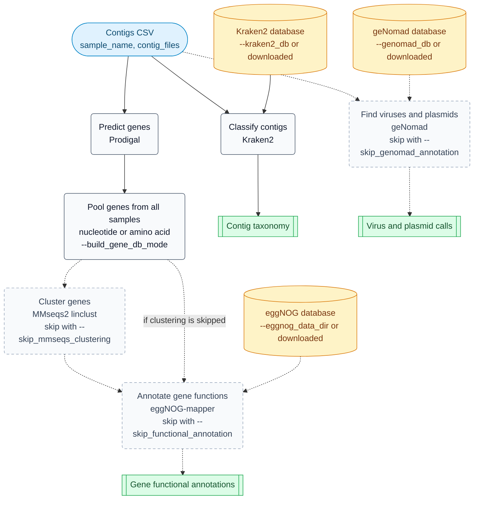
```mermaid
flowchart TB
    contigs(["Contigs CSV<br/>sample_name, contig_files"]):::input
    kraken_db[("Kraken2 database<br/>--kraken2_db or downloaded")]:::db
    genomad_db[("geNomad database<br/>--genomad_db or downloaded")]:::db
    eggnog_db[("eggNOG database<br/>--eggnog_data_dir or downloaded")]:::db

    prodigal("Predict genes<br/>Prodigal"):::step
    kraken("Classify contigs<br/>Kraken2"):::step
    genomad("Find viruses and plasmids<br/>geNomad<br/>skip with --skip_genomad_annotation"):::optional
    pool("Pool genes from all samples<br/>nucleotide or amino acid<br/>--build_gene_db_mode"):::step
    mmseqs("Cluster genes<br/>MMseqs2 linclust<br/>skip with --skip_mmseqs_clustering"):::optional
    eggnog("Annotate gene functions<br/>eggNOG-mapper<br/>skip with --skip_functional_annotation"):::optional

    tax[["Contig taxonomy"]]:::output
    mge[["Virus and plasmid calls"]]:::output
    fun[["Gene functional annotations"]]:::output

    contigs --> prodigal --> pool
    contigs --> kraken --> tax
    kraken_db --> kraken
    contigs -.-> genomad -.-> mge
    genomad_db -.-> genomad
    pool -.-> mmseqs -.-> eggnog
    pool -. "if clustering is skipped" .-> eggnog
    eggnog_db -.-> eggnog
    eggnog -.-> fun

    classDef input fill:#e0f2fe,stroke:#0284c7,color:#0c4a6e
    classDef db fill:#fef3c7,stroke:#d97706,color:#78350f
    classDef step fill:#f8fafc,stroke:#475569,color:#0f172a
    classDef optional fill:#f8fafc,stroke:#94a3b8,color:#334155,stroke-dasharray:5 4
    classDef choice fill:#f3e8ff,stroke:#9333ea,color:#581c87
    classDef output fill:#dcfce7,stroke:#16a34a,color:#14532d
```

#### How to run
    
To run this roadmap, you need to provide a CSV file containing the following columns:

- sample_name
- contig_files (path to the contig fasta file for each sample)

You can run the roadmap using the following command:

```bash
nextflow run pipelines.nf --roadmap_id "annotate_contigs" --input_contigs "<path-to-samples.csv>" -profile apptainer,alpine
```

##### Relevant optional arguments

- **--skip_mmseqs_clustering**: By default, the genes are clustered using MMseqs2 linclust to reduce redundancy before annotation. If you want to skip this step and annotate all the genes, you can provide this argument.

- **--mmseqs_linclust_identity**: If clustering is performed, this argument specifies the sequence identity threshold for clustering. Default is 0.95 (95% identity).

- **--build_gene_db_mode**: This argument specifies the mode for building the gene database. It can be either "amino_acid" or "nucleotide". Default is "nucleotide".

- **--skip_functional_annotation**: If you want to skip the functional annotation step with eggNOG-mapper, you can provide this argument.

- **--mmseqs_linclust_coverage**: If clustering is performed, this argument specifies the coverage threshold for clustering. Default is 0.8 (80% coverage). Note that the pipeline is fixed to use coverage mode 1 in mmseqs2 (target coverage).

- **--kraken2_db**: Path to the KRAKEN2 database. If this is not provided, the standard KRAKEN2 database will be downloaded. NOTE: you should provide the **directory** containing the KRAKEN2 database files

- **--genomad_db**: Path to the Genomad database. If this is not provided, the default Genomad database will be downloaded. NOTE: you should provide the **directory** containing the Genomad database files

- **--skip_genomad_annotation**: If you want to skip the Genomad annotation step, you can provide this argument.

**NOTES** If provide --skip_mmseqs_clustering, and not --skip_functional_annotation, all the genes from all contigs will be annotated using eggNOG-mapper.

------

### subsample_reads

#### Description

This roadmap randomly subsamples a set of sequencing reads at one or more user-defined fractions and produces a FASTQ file (or pair of FASTQ files for paired-end data) for each sample × fraction combination. It is useful for rarefaction analyses, benchmarking, and preparing downsampled datasets.

Subsampling is performed with **BBTools `reformat.sh`**, which processes both mates of a paired-end library together, guaranteeing that read pairing is preserved in the output.

Two outputs are produced per sample × fraction:

- **Subsampled FASTQ file(s)** written to:
  ```
  <output_dir>/subsampled_reads/<sample_name>/fraction_<fraction>/
  ```
- **A CSV file** (`<sample_name>_<fraction>.csv`) written to:
  ```
  <output_dir>/subsampled_reads/csv/
  ```
  The CSV has `sample_name`, `reads1`, `reads2` columns with absolute paths, so it can be passed directly to other roadmaps via `--input_file` or `--input_reads`.

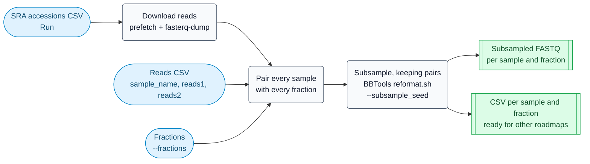
```mermaid
flowchart LR
    csv(["Reads CSV<br/>sample_name, reads1, reads2"]):::input
    sra(["SRA accessions CSV<br/>Run"]):::input
    fractions(["Fractions<br/>--fractions"]):::input
    dl("Download reads<br/>prefetch + fasterq-dump"):::step
    combine("Pair every sample<br/>with every fraction"):::step
    sub("Subsample, keeping pairs<br/>BBTools reformat.sh<br/>--subsample_seed"):::step
    fq[["Subsampled FASTQ<br/>per sample and fraction"]]:::output
    table[["CSV per sample and fraction<br/>ready for other roadmaps"]]:::output

    sra --> dl --> combine
    csv --> combine
    fractions --> combine --> sub
    sub --> fq
    sub --> table

    classDef input fill:#e0f2fe,stroke:#0284c7,color:#0c4a6e
    classDef db fill:#fef3c7,stroke:#d97706,color:#78350f
    classDef step fill:#f8fafc,stroke:#475569,color:#0f172a
    classDef optional fill:#f8fafc,stroke:#94a3b8,color:#334155,stroke-dasharray:5 4
    classDef choice fill:#f3e8ff,stroke:#9333ea,color:#581c87
    classDef output fill:#dcfce7,stroke:#16a34a,color:#14532d
```

#### How to run

**Local input**: Provide a CSV with the following columns:

- `sample_name`
- `reads1`
- `reads2`

```bash
nextflow run pipelines.nf --roadmap_id subsample_reads \
    --input_type local \
    --input_file "<path-to-samples.csv>" \
    --fractions "0.1,0.25,0.5" \
    -profile apptainer,alpine
```

**SRA input**: Provide a CSV with a single column:

- `Run` (SRA accession ID, e.g. `SRR12345678`)

```bash
nextflow run pipelines.nf --roadmap_id subsample_reads \
    --input_type sra \
    --input_file "<path-to-sra-accessions.csv>" \
    --fractions "0.1,0.25,0.5" \
    -profile apptainer,alpine
```

##### Relevant optional arguments

- **--fractions** : Comma-separated list of fractions to sample. Each value must be between 0 and 1 (e.g. `"0.1,0.25,0.5"`). Every sample is processed at every fraction.
- **--subsample_seed** : Random seed passed to `reformat.sh` for reproducibility. Default is `42`.

------

### synthetic_data

#### Description

This roadmap builds synthetic sequencing data. The kind of data is selected with `--mode`. Currently supported modes:

1. **short_read_from_genome** (default): simulates short reads from one or more genome FASTA files. Two simulators are available through `--synthetic_read_simulator`:
    - **art_illumina** (default): [ART](https://www.niehs.nih.gov/research/resources/software/biostatistics/art) with empirical, platform-specific Illumina error profiles.
    - **wgsim**: simple simulator with a uniform base error rate. It can also plant SNPs and indels in the reads; the planted mutations are written to `<sample_name>_wgsim_mutations.txt`. The number of read pairs is computed from the genome length and `--synthetic_coverage`.

Two outputs are produced per genome:

- **Synthetic FASTQ file(s)** (`<sample_name>_1.fastq.gz`, `<sample_name>_2.fastq.gz`, or `<sample_name>.fastq.gz` for single-end) written to:
  ```
  <output_dir>/synthetic_reads/<sample_name>/
  ```
- **A CSV file** (`<sample_name>.csv`) with `sample_name`, `reads1`, `reads2` columns written to:
  ```
  <output_dir>/synthetic_reads/csv/
  ```
  The CSV can be passed directly to other roadmaps via `--input_file`.

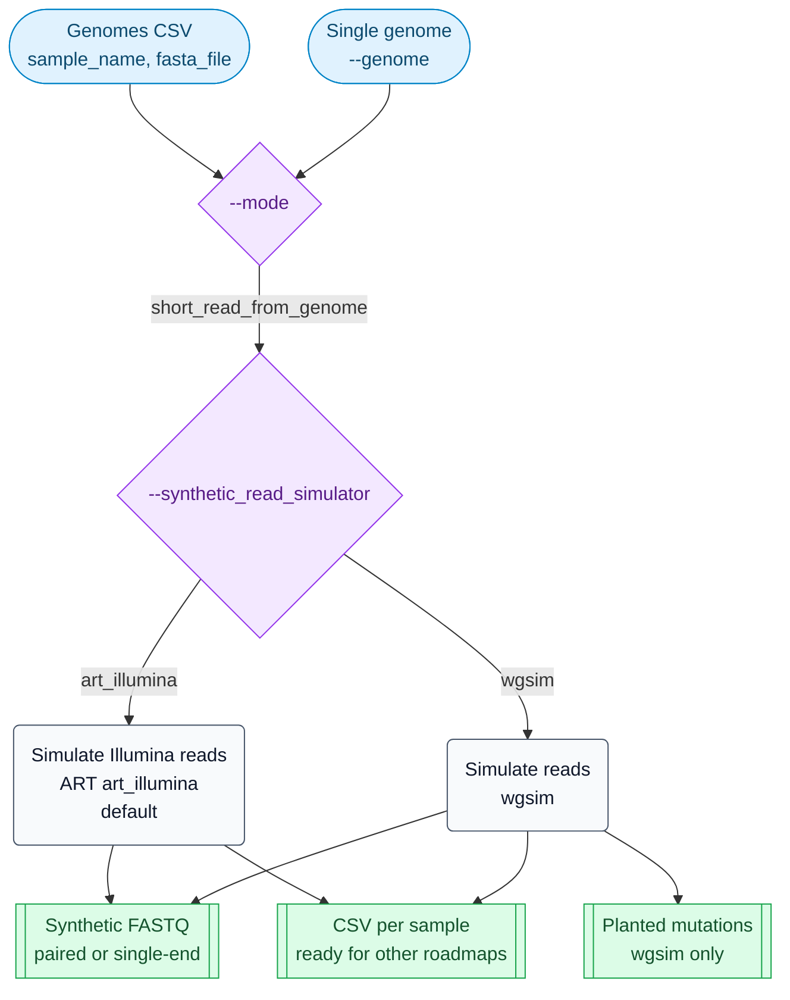
```mermaid
flowchart TB
    csv(["Genomes CSV<br/>sample_name, fasta_file"]):::input
    one(["Single genome<br/>--genome"]):::input
    mode{"--mode"}:::choice
    sim{"--synthetic_read_simulator"}:::choice
    art("Simulate Illumina reads<br/>ART art_illumina<br/>default"):::step
    wgsim("Simulate reads<br/>wgsim"):::step
    fq[["Synthetic FASTQ<br/>paired or single-end"]]:::output
    table[["CSV per sample<br/>ready for other roadmaps"]]:::output
    mut[["Planted mutations<br/>wgsim only"]]:::output

    csv --> mode
    one --> mode
    mode -- "short_read_from_genome" --> sim
    sim -- "art_illumina" --> art
    sim -- "wgsim" --> wgsim
    art --> fq
    art --> table
    wgsim --> fq
    wgsim --> table
    wgsim --> mut

    classDef input fill:#e0f2fe,stroke:#0284c7,color:#0c4a6e
    classDef db fill:#fef3c7,stroke:#d97706,color:#78350f
    classDef step fill:#f8fafc,stroke:#475569,color:#0f172a
    classDef optional fill:#f8fafc,stroke:#94a3b8,color:#334155,stroke-dasharray:5 4
    classDef choice fill:#f3e8ff,stroke:#9333ea,color:#581c87
    classDef output fill:#dcfce7,stroke:#16a34a,color:#14532d
```

#### How to run

Provide a CSV with the following columns:

- `sample_name`
- `fasta_file`

```bash
nextflow run pipelines.nf --roadmap_id synthetic_data \
    --mode short_read_from_genome \
    --input_file "<path-to-genomes.csv>" \
    --synthetic_coverage 20 \
    -profile apptainer,alpine
```

Or, for a single genome (the sample name is taken from the file name):

```bash
nextflow run pipelines.nf --roadmap_id synthetic_data \
    --genome "<path-to-genome.fasta>" \
    --synthetic_read_simulator wgsim \
    -profile apptainer,alpine
```

##### Relevant optional arguments

- **--mode** : Type of synthetic data. Options: `short_read_from_genome`. Default is `short_read_from_genome`.
- **--synthetic_read_simulator** : `art_illumina` or `wgsim`. Default is `art_illumina`.
- **--synthetic_paired** : Simulate paired-end reads. Default is `true`.
- **--synthetic_read_length** : Read length. Default is `150`. With ART it must not exceed the maximum read length of the chosen platform.
- **--synthetic_coverage** : Fold coverage of the genome. Default is `10`.
- **--synthetic_fragment_mean** : Mean fragment size for paired-end reads. Default is `400`.
- **--synthetic_fragment_sd** : Standard deviation of the fragment size. Default is `50`.
- **--synthetic_seed** : Random seed for reproducibility. Default is `42`.
- **--art_illumina_platform** : ART sequencing system, e.g. `HS25`, `HSXt`, `MSv3`, `NS50`. Default is `HS25`.
- **--art_illumina_args** : Extra arguments passed to `art_illumina`. Default is `""`.
- **--wgsim_error_rate** : wgsim base error rate. Default is `0.02`.
- **--wgsim_mutation_rate** : wgsim mutation rate. Set to `0` for reads without planted mutations. Default is `0.001`.
- **--wgsim_indel_fraction** : Fraction of planted mutations that are indels. Default is `0.15`.
- **--wgsim_args** : Extra arguments passed to `wgsim`. Default is `""`.
