# Roadmaps

## Table of Contents
- [Steps](#steps)
- [Optional arguments](#optional-arguments)
- [Roadmaps](#roadmaps)
  - [quality_control](#quality_control)
  - [roadmap_1](#roadmap_1)
  - [roadmap_2](#roadmap_2)
  - [roadmap_3](#roadmap_3)
  - [roadmap_1_3_2](#roadmap_1_3_2)
  - [roadmap_4](#roadmap_4)
  - [roadmap_3_2](#roadmap_3_2)
  - [roadmap_5](#roadmap_5)
  - [roadmap_6](#roadmap_6)
  - [roadmap_7](#roadmap_7)
  - [roadmap_9](#roadmap_9)
  - [annotate_contigs](#annotate_contigs)

------

Roadmaps are end-to-end workflows. A rule of thumb for a roadmap is to be useful enough on its own to be called seperately. However, it must be designed in a way to work well with other roadmaps. This document provides a list of available roadmaps and their descriptions as well as the instrunctions to run them.

## Steps

1. **Install Nextflow**: Make sure you have Nextflow installed on your system. The recommended way to install Nextflow is via conda:

    ```bash
    module load anaconda
    conda create -n nf-pipeline -c bioconda nextflow
    conda activate nf-pipeline
    ```

2. **Clone the repository**: Go to an appropriate location and clone this repository to your local machine using git:

    ```bash
    cd /path/to/your/directory
    git clone https://github.com/OlmLab/bioinformatics_pipelines.git
    ```

3. **Pick a roadmap**: Road maps are designed to perform required computations end-to-end. For a full reference, please see below for the list of available roadmaps and their descriptions. A roadmaps are designed to perform some end-to-end analysis that are common in bioinformatics.

4. **Figure out the execution profile**: you can run the pipelines using three  environments:

- **local**: You can run the pipelines on your local machine. For this you need to have
all the necessary tools installed.

- **docker**: If you have Docker installed, you can run the pipeline with this option using docker as profile.

- **apptainer**: If you have Apptainer installed, you can run the pipeline with this option using apptainer as profile.

- **other cluster profiles**: More specific profiles are available for different
clusters including Alpine HPC, GutBot, Blanca.

5. **Run the pipeline**: To run a pipeline, navigate to the directory containing the pipeline and execute the following command:

    ```bash
    nextflow run pipelines.nf --roadmap_id <roadmap-id> <roadmap-specific-arguments> -profile   <local|docker|apptainer,cluster-profile>
    ```

    If you want to run this pipeline on a cluster, after making sure that you have the  necessary configuration file, you can run the pipeline using the following command:

    ```bash
    nextflow run pipelines.nf --roadmap_id <roadmap-id> <roadmap-specific-arguments> -profile   <local|docker|apptainer,cluster-profile>
    ```

    Replace `<roadmap-id>` with the name of the pipeline you want to run with the path to your  server configuration file. Each roadmap has its own set of arguments that can be passed to   the pipeline. For Alpine HPC and GutBot there are ready configuration files.

    or (RECOMENDED) you can skip step 2, and run the pipeline directly by using the following   command:

    ```bash
    nextflow run OlmLab/bioinformatics_pipelines --roadmap_id <roadmap-id>  -profile <local|docker|apptainer,cluster-profile> <roadmap-specific-arguments>
    ```

    In this case, the configs will be stored in $HOME/.nextflow/assets/OlmLab/  bioinformatics_pipelines/config/

### Optional arguments

- `-resume`: Resume the pipeline from the last completed task. This is useful if the pipeline was interrupted or if you want to re-run only a subset of tasks.

## Roadmaps

The following table summerizes the available roadmaps in this repository:

| Roadmap ID        | Description                                                  | inputs | Outputs |
|-------------------|--------------------------------------------------------------|--------|---------|
| quality_control   | Quality control of raw sequencing data using fastp and host decontamination. | raw reads or SRA accession IDs, host genome | quality-controlled reads and QC stats|
| roadmap_1        | Metagenomics analysis using de novo assembly and binning.     | quality-controlled reads or raw reads/SRA IDs, host genome | metagenome-assembled genomes (MAGs) |
| roadmap_2        | Strain-level analysis using inStrain.                        | reads or BAM files, genomes or stb file, genome database | inStrain profiles and comparisons |
| roadmap_3        | Dereplication of genomes using dRep.                         | genomes | dereplicated genomes |
| roadmap_1_3_2    | End-to-end analysis: bin extraction, dereplication, strain-level analysis. | raw reads or SRA IDs, host genome | dereplicated genomes, inStrain profiles, comparisons |
| roadmap_4        | Quality control and host decontamination of raw sequencing data. | raw reads or SRA IDs, host genome | quality-controlled reads |
| roadmap_3_2      | Dereplication of genomes followed by strain-level analysis.   | reads or BAM files, genomes | dereplicated genomes, inStrain profiles and comparisons |
| roadmap_5        | Mapping reads to reference genomes.                          | reads, genomes | mapped reads (BAM files) |
| roadmap_6        | Metagenomics analysis using reference-based approach.        | QCed reads | taxonomic and functional profiles |
| roadmap_7        | Taxonomic and functional annotation of genomes.              | genomes | annotated genomes |
| roadmap_9        | Detection of circular RNA contigs from RNA-Seq data.         | RNA-Seq reads, reference transcriptome | circular RNA contigs and mappings |
| annotate_contigs | Taxonomic and functional annotation of contigs.              | contigs | annotated contigs |

------

### quality_control

#### Description

This pipeline performs quality control on raw sequencing data using fastp. It takes paired-end reads as input and generates quality-controlled reads as output. The workflow includes the following steps:

1. **Quality Control with fastp**: The raw sequencing reads are processed using fastp to remove low-quality reads and adapters. The output is a set of quality-controlled reads.

2. **Host Decontamination**: The quality-controlled reads are then decontaminated using a reference host genome. This step removes any reads that map to the host genome, resulting in a set of cleaned reads.


#### How to run

Multiple samples can be processed in parallel with nextflow. Quality control workflow needs three inputs:

- sample_name

- reads

- host_genome

Currently there are two ways to run this pipeline:

- **local**: You have the samples locally in the execution environment. In this case, you need to provide a csv file containing at least three columns:

- sample_name

- reads1

- reads2

Also you need to provide the path to the host genome. An example run with this mode looks like this:

```bash
nextflow run pipelines.nf --roadmap_id quality_control --host_genome "raw_data/ref_genome.fa" --input_type "local" --input_file <path-to-csv-files> -profile apptainer,alpine
```
**NOTE** You should change the config file according to your environment.

- **sra**: In this case you only need a CSV file describig the accession id of your runs:

- Run

 An example run with this mode looks like this:

```bash
nextflow run pipelines.nf --roadmap_id quality_control --host_genome "raw_data/ref_genome.fa" --input_type "sra" --input_file <path-to-csv-files> -profile apptainer,alpine
```

### roadmap_1

#### Description

This roadmap is designed to perform metagenomics analysis using a de novo assembly approach. The workflow starts with **quality-controlled** sequencing data and performs the following steps:

1. **De Novo Assembly**: The cleaned reads are then assembled into contigs using MEGAHIT.

2. **Binning**: The assembled contigs are binned into metagenome-assembled genomes (MAGs) using MetaBAT2.

**NOTE**: This roadmap specifically does not include functional or taxonomic annotation of the bins. Those are delegated to other roadmaps.



#### How to run

Multiple samples can be processed in parallel with nextflow. Roadmap1 workflow needs three inputs:

- sample_name

- reads

Currently there are two ways to run this roadmap:

- **local**: You have the samples locally in the execution environment. In this case, you need to provide a csv file containing at least three columns:

- sample_name

- reads1

- reads2

Also you need to provide the path to the host genome. An example run with this mode looks like this:

```bash
nextflow run pipelines.nf --roadmap roadmap_1 --input_type "local" --input_file <path-to-csv-files> -profile apptainer,alpine
```

**NOTE** You should change the config file according to your environment. 

- **sra**: In this case you only need a CSV file describig the accession id of your runs:

- Run

An example run with this mode looks like this:

```bash
nextflow run pipelines.nf --roadmap_id roadmap_1 --host_genome "raw_data/ref_genome.fa"--input_type "sra" --input_file <path-to-csv-files> -profile apptainer,alpine
```

### roadmap_2

#### Description

This roadmap is designed to perform strain-level analysis using inStrain. You can provide a list of samples and genomes in the form of a CSV file. The workflow starts with the following steps:

1. **Concatenating the Genomes**: The genomes are concatenated into one fasta file to run inStrain in database mode.
2. **Aligning the reads to the concatenated fasta file** : The reads are aligned to the concatenated fasta file using bowtie2. This step generates sorted BAM file for each sample.
3. **Profile each Sample**: Each sample is profiled against the concatenated fasta file using inStrain. This step generates a profile for each sample.
4. **Compare the Profiles**: The profiles are compared using inStrain compare. This step generates a comparison file for each sample.


#### How to run

Currently there are two ways to run this roadmap:

1- You have prepared your concatenated genomes database and you have a STB file ready. 

- **samples.csv**: This file should contain the following columns:

- sample_name

- reads1

- reads2

- **stb file**: stb file is a text file made with a script accompanying dRep check inStrain and dRep documentation for more information. It contains the information about the mapping between contigs and genomescommand

- **genome database**: This is a fasta file containing all the genomes you want to compare merged in one file. You can run the roadmap using the following command

If you want to use the first option, you use this roadmap like this:

```bash
nextflow run pipelines.nf --roadmap_id "roadmap_2" --input_reads "<path-to-samples.csv"  --is_genome_db <path-to-genome-database> --is_stb_db <path-to-stb-file> -profile apptainer,alpine
```

2- You have a list of samples and genomes and you want to make the genome database and the stb files using the pipeline.

In this case, you need to provide two CSV files:

- **samples.csv**: This file should contain the following columns:
- sample_name
- reads1
- reads2

- **genomes.csv**: This file should contain one column:
    - fasta_files (address to each fasta file)

If you want to choose the second option, you can run the roadmap using the following command:

```bash
nextflow run pipelines.nf --roadmap_id "roadmap_2" --input_reads "<path-to-samples.csv>" --input_fastas "<path-to-genomes.csv>" -profile apptainer,alpine
```

In any of the previous cases, you can alternatively provide bam files instead of the reads. In this case you still provide the samples.csv file with the following columns:

- sample_name
- bam_files

You can run the roadmap using the following command (As an example when youhave the stb file and the genome database):

```bash
nextflow run pipelines.nf --roadmap_id "roadmap_2"  --input_bams "<path-to-samples.csv"  --is_genome_db <path-to-genome-database> --is_stb_db <path-to-stb-file> -profile apptainer,alpine

```

##### Optional arguments

- **--is_genes**: If you already have the genes of your input fasta(s) you can provide the path to the genes file. Otherwise, the genes will be extracted from the input fasta(s) using prodigal.

**NOTE** You should change the config file according to your environment.

------

### roadmap_3

#### Description

This roadmap is designed to perform dereplication on a set of provided genomes. The workflow starts with the following steps:

1. **writing the genomes to a text file**: Avoids command line length issues.

2. **Dereplicating the genomes**: The genomes are dereplicated using dRep.


#### How to run

So far, the only way to run this roadmap is to provide glob address to the genomes. The genomes should be in fasta format. You can run the roadmap using the following command:

```bash
nextflow run pipelines.nf --roadmap_id "roadmap_3" --input_genomes "<path-to-genomes>" -profile apptainer,alpine 
```

**NOTES**

- You should change the profiles according to your environment. 

- The input_genomes should be a glob address to the genomes. For example, if you have a folder named "genomes" containing all the genomes, you can use "genomes/*.fasta" as the input_genomes.

- It is important to know that checkm saves the temporary files by default to $TMPDIR. If the workspace you are working in does not provide enough space in /tmp try doing `export TMPDIR=<PATH_TO_SOMEWHERE_WITH_ENOUGH_SPACE>

### roadmap_1_3_2

#### Description

This roadmap provides end-to-end analysis of a set of samples. It extracts the bins using roadmap_1, dereplicates the genomes using roadmap_3, and then performs strain-level analysis using roadmap_2. The workflow starts with the following steps:

1. **Extracting the bins**: The raw sequencing data is first subjected to quality control using fastp. Next using a reference genome, the reads are decontaminated. The cleaned reads are then assembled into contigs using MEGAHIT. The assembled contigs are binned into metagenome-assembled genomes (MAGs) using MetaBAT2.

2. **Dereplicating the genomes**: The bins are dereplicated using dRep.

3. **Strain-level analysis**: The genomes are combined to make one fasta file. The reads are aligned to the genomes using bowtie2. inStrain is then used to profile the reads against the fasta files. Finally, the profiles are compared using inStrain compare.


#### How to run

This roadmap has identical input to roadmap_1. You can either provide a CSV file containing the sample names and reads or a CSV file containing the accession ids of the samples. The host genome is also required. You can run the roadmap using the following command:

```bash
nextflow run pipelines.nf --roadmap_id "roadmap_1_3_2" --host_genome "<path-to-host-genome>" --input_type "local" --input_file <path-to-csv-files> -profile apptainer,alpine 
```

**NOTES** 

-   You should change the profile according to your environment. 
-   The input_file should be a CSV file containing the sample names and reads or a CSV file containing the accession ids of the samples. 
-   The host genome is also required.

------

### roadmap_4

#### Description

This roadmap is a subset of roadmap_1. It is designed to QC the reads and decontaminate them using a reference genome. The workflow starts with the following steps


#### How to run

Similar to roadmap_1, there are two ways to run this roadmap:

- **local**: You have the samples locally in the execution environment. In this case, you need to provide a csv file containing at least three columns:

    - sample_name
    - reads1
    - reads2

Also you need to provide the path to the host genome. An example run with this mode looks like this:

```bash
nextflow run pipelines.nf --roadmap roadmap_4 --host_genome "raw_data/ref_genome.fa" --input_type "local" --input_file <path-to-csv-files> -profile apptainer,alpine 
```

**NOTES**

- You should change the config file according to your environment. 

- **sra**: In this case you only need a CSV file describing the accession id of your runs:

    - Run

An example run with this mode looks like this:

```bash
nextflow run pipelines.nf --roadmap roadmap_4 --host_genome "<path-to-reference-genome-fasta" --input_type "sra" --input_file <path-to-csv-files> -profile apptainer,alpine
```

------

### roadmap_3_2

#### Description

This roadmap first dereplicates a list of input genomes and then performs strain-level analysis using inStrain for the input reads. This roadmapcan be helpful for users who want to perform comparative genomics on closely related genomes. The workflow starts with the following steps:

1. **Dereplicating the genomes**: The genomes are dereplicated using dRep.
2. **Aligning the reads to the concatenated fasta file** : The reads are aligned to the concatenated fasta file using bowtie2. This step generates sorted BAM file for each sample.
3. **Profile each Sample**: Each sample is profiled against the concatenated fasta file using inStrain. This step generates a profile for each sample.
4. **Compare the Profiles**: The profiles are compared using inStrain compare. This step generates a comparison file for each sample.


#### How to run

To run this roadmap, you need to provide a CSV file containing the following columns:

- sample_name
- reads1
- reads2

Also, you need to provide a CSV file containing the paths to the genomes you want to dereplicate. This file should contain one column:

- fasta_files (address to each fasta file)

You can run the roadmap using the following command:

```bash
nextflow run pipelines.nf --roadmap_id "roadmap_3_2" --input_reads "<path-to-samples.csv>" --input_fastas "<path-to-genomes.csv>" -profile apptainer,alpine
```

##### Relevant optional arguments

- **--drep_s_ani** : The average nucleotide identity threshold for dereplication. Default is 0.95

- **--drep_extra_weight_table**: path to a tab separated text file that assignes extra weights to genomes. something like this:

```
genome1  2
```

Usually this option is used to prioritize specific genomes.

------

### roadmap_5

#### Description

This roadmap is designed only to map a set of reads to a set of reference genomes. It offers two modes of operation:

1. **paired** : The reads are pared with genomes so any task would be aligning the reads to the corresponding genome.
2. **cross** : Each sample is aligned to each fasta file in the input genomes.


#### How to run

To run this roadmap, you need to provide a CSV file containing the following columns:

- sample_name
- reads1
- reads2

Also, you need to provide a CSV file containing the paths to the genomes you want to map the reads to. This file should contain one column:

- fasta_files (address to each fasta file)

You can run the roadmap using the following command:

```bash
nextflow run pipelines.nf --roadmap_id "roadmap_5" --input_reads "<path-to-samples.csv>" --input_fastas "<path-to-genomes.csv>" -profile apptainer,alpine
```

##### Relevant optional arguments

- **--roadmap_5_pairmode** : By default, the roadmap runs in pair mode. Otherwise, you should provide "cross" as the argument.

------

### roadmap_6

#### Description

This roadmap is designed to perform metagenomics analysis using a reference-based approach. It starts with raw sequencing data and performs the following steps:

1. **Estimate abundance with Sylph**: By default, GTDB is used as the reference database. 
2. **Estimate abundance with Metaphlan**: This will run Metaphlan to estimate the abundance of taxa in the samples.
3. **Classify reads and estimate abundance with KRAKEN2 and BRACKEN**: This will run KRAKEN2 to classify the reads and estimate the abundance of taxa in the samples.
4. **Estimate functional profile of the samples with HUMAnN**: This will run HUMAnN3 to estimate the functional profile of the samples.


#### How to run

To run this roadmap, you need to provide a CSV file containing the following columns:

- sample_name
- reads1
- reads2

You can run the roadmap using the following command:

```bash
nextflow run pipelines.nf --roadmap_id "roadmap_6" --input_file "<path-to-samples.csv>" -profile apptainer,alpine
```

##### Relevant optional arguments

- **--sylph_db** : Path to the Sylph database. If this is not provided, the default GTDB database will be used. NOTE: you should directly provide the path to the Sylph database **file** ending in syldb.

- **--sylph_db_link**: If you want to download the Sylph database from a specific link, you can provide the link here. 

- **--metaphlan_db** path to the Metaphlan database. If this is not provided, the default Metaphlan database will be downloaded. NOTE: you should provide the **directory** containing the Metaphlan database ending in metaphlan

- **--kraken2_db** path to the KRAKEN2 database. If this is not provided, the standard KRAKEN2 database will be downloaded. NOTE: Similar to the Metaphlan database, you should provide the **directory** containing the KRAKEN2 database ending in kraken2

- **--humann_chocophlan** path to the Chocophlan database. If this is not provided, the default Chocophlan database will be downloaded. NOTE: Similar to the Metaphlan database, you should provide the **directory** containing the Chocophlan database ending in chocophlan

- **--humann_uniref** path to the Uniref database. If this is not provided, the default Uniref database will be downloaded. NOTE: Similar to the Metaphlan database, you should provide the **directory** containing the Uniref database ending in uniref

- **--metaphlan_b_distance**: type of distance metric to use for Metaphlan beta diversity analysis. 

- **--metaphlan_diversity**: type of diversity metric to use for Metaphlan diversity analysis. Default is beta diversity.

- **--metaphlan_db**: Path to the Metaphlan database. If this is not provided, it will be downloaded automatically.

- **--exclude_sylph**: If you want to exclude Sylph from the analysis, you can provide this argument. 

- **--exclude_metaphlan**: If you want to exclude Metaphlan from the analysis, you can provide this argument.

- **--exclude_kraken2**: If you want to exclude KRAKEN2 from the analysis, you can provide this argument.

- **--exclude_humann**: If you want to exclude HUMAnN from the analysis, you can provide this argument.

------

### roadmap_7

#### Description

This roadmap is designed to do both taxonomic and functional annotation of a set of genomes. It starts with a set of genomes and performs the following steps:

1. **Taxonomic annotation with GTDB**: The genomes are annotated using GTDB.
2. **Functional annotation**: UNDER CUSTRUCTION


#### How to run

To run this roadmap, you need to provide either path to the genomes or a CSV file containing the paths to the genomes you want to annotate. This file should contain one column:

- fasta_files (address to each fasta file)

You can run the roadmap using the following commands:

```bash
nextflow run pipelines.nf --roadmap_id "roadmap_7" --bins_dir "<path-to-genomes>" -profile apptainer,alpine
```

or 

```bash
nextflow run pipelines.nf --roadmap_id "roadmap_7" --input_bins_table "<path-to-genomes-table.csv>" -profile apptainer,alpine
```

##### Relevant optional arguments

- **--gtdb_db** : Path to the GTDB database. If this is not provided, the GTDB database will be downloaded.

------

### roadmap_9

#### Description

This roadmap is designed to detect circular RNA contigs from RNA-Seq data. The roadmap follows these steps:

1. **Assembly**: The RNA-Seq reads are assembled into contigs using rnaSpades.
2. **Circular Contig Detection**: The assembled contigs are analyzed to identify circular RNA structures. This is done using the cirit tool. 
3. **Mapping**: The identified circular contigs are mapped to a reference transcriptome using minimap2.


#### How to run

Multiple samples can be processed in parallel with nextflow. Roadmap_9 workflow needs three inputs:

- sample_name
- reads
- reference_transcriptome (e.g. https://ftp.ebi.ac.uk/pub/databases/gencode/Gencode_human/release_48/)

Currently there are two ways to run this roadmap:

- **local**: You have the samples locally in the execution environment. In this case, you need to provide a csv file containing at least three columns:

    - sample_name
    - reads1
    - reads2

Also you need to provide the path to the reference transcriptome. An example run with this mode looks like this:

```bash
nextflow run pipelines.nf --roadmap roadmap_9 --reference_transcriptome <path-to-reference-transcriptome> --input_type "local" --input_file <path-to-csv-files> -profile apptainer,alpine
```

**NOTE** You should change the config file according to your environment. 

- **sra**: In this case you only need a CSV file describing the accession id of your runs:

    - Run

An example run with this mode looks like this:

```bash
nextflow run pipelines.nf --roadmap roadmap_9 --reference_transcriptome <path-to-reference-transcriptome> --input_type "sra" --input_file <path-to-csv-files> -profile apptainer,alpine
```

------

### annotate_contigs

#### Description

This roadmap is designed to perform taxonomic and functional annotation of contigs and the genes identified on them. The workflow starts with the following steps:

1. Finding genes on the contigs using Prodigal.
2. Assining taxonomy to the contigs using Kraken2.
3. concatenating all the genes from all the samples into one fasta file.
4. (Optional) Clustering the genes using MMseqs2 linclust to reduce redundancy.
5. Annotating the genes using eggNOG-mapper. If clustering is performed, the representative sequences are annotated. Otherwise, all the genes are annotated.


#### How to run
To run this roadmap, you need to provide a CSV file containing the following columns:

- sample_name
- contigs (path to the contig fasta file for each sample)

You can run the roadmap using the following command:

```bash
nextflow run pipelines.nf --roadmap_id "annotate_contigs" --input_contigs "<path-to-samples.csv>" -profile apptainer,alpine
```

##### Relevant optional arguments

- **--skip_mmseqs_clustering**: By default, the genes are clustered using MMseqs2 linclust to reduce redundancy before annotation. If you want to skip this step and annotate all the genes, you can provide this argument.

- **--mmseqs_linclust_identity**: If clustering is performed, this argument specifies the sequence identity threshold for clustering. Default is 0.95 (95% identity).

- **--build_gene_db_mode**: This argument specifies the mode for building the gene database. It can be either "amino_acid" or "nucleotide". Default is "nucleotide".

- **--skip_functional_annotation**: If you want to skip the functional annotation step with eggNOG-mapper, you can provide this argument.

- **--mmseqs_linclust_coverage**: If clustering is performed, this argument specifies the coverage threshold for clustering. Default is 0.8 (80% coverage). Note that the pipeline is fixed to use coverage mode 1 in mmseqs2 (target coverage).

**NOTES** If provide --skip_mmseqs_clustering, and not --skip_functional_annotation, all the genes from all contigs will be annotated using eggNOG-mapper.