# Roadmaps
------
Roadmaps are end-to-end workflows in nextflow. A rule of thumb for a roadmap is to be useful enough on its own to be called seperately. However, it must be designed in a way to work well with other roadmaps. This document provides a list of available roadmaps and their descriptions as well as the instrunctions to run them.

## roadmap_1
### Description
This roadmap is designed to perform metagenomics analysis using a de novo assembly approach. The workflow starts with raw sequencing data and performs the following steps:
1. **Quality Control**: The raw sequencing data is first subjected to quality control using fastp. Next using a reference genome, the reads are decontaminated.
2. **De Novo Assembly**: The cleaned reads are then assembled into contigs using MEGAHIT.
3. **Binning**: The assembled contigs are binned into metagenome-assembled genomes (MAGs) using MetaBAT2.
4. **Abundance Estimation**: The abundance of each bin is estimated using CoverM.

**NOTE**: This roadmap specifically does not include functional or taxonomic annotation of the bins. Those are delegated to other roadmaps.


### How to run
Multiple samples can be processed in parallel with nextflow. Roadmap1 workflow needs three inputs:
-   sample_name
-   reads
-   host_genome

Currently there are two ways to run this roadmap:
-   **local**: You have the samples locally in the execution environment. In this case, you need to provide a csv file containing at least three columns:
    -   sample_name
    -   reads1
    -   reads2
Also you need to provide the path to the host genome. An example run with this mode looks like this:
    ```bash
    nextflow run pipelines.nf --roadmap roadmap_1 --host_genome "raw_data/ref_genome.fa" --input_type "local" --input_file <path-to-csv-files> -c configs/local.config
    ```
    **NOTE** You should change the config file according to your environment. 

-   **sra**: In this case you only need a CSV file describig the accession id of your runs:
    -   Run

    An example run with this mode looks like this:
    ```bash
    nextflow run pipelines.nf --roadmap roadmap_1 --host_genome "raw_data/ref_genome.fa" --input_type "sra" --input_file <path-to-csv-files> -c configs/local.config
    ```
## roadmap_2
### Description
This roadmap is designed to perform strain-level analysis using inStrain. You can provide a list of samples and genomes in the form of a CSV file. The workflow starts with the following steps:
1. **Concatenating the Genomes**: The genomes are concatenated into one fasta file to run inStrain in database mode.
2. **Aligning the reads to the concatenated fasta file** : The reads are aligned to the concatenated fasta file using bowtie2. This step generates sorted BAM file for each sample.
3. **Profile each Sample**: Each sample is profiled against the concatenated fasta file using inStrain. This step generates a profile for each sample.
4. **Compare the Profiles**: The profiles are compared using inStrain compare. This step generates a comparison file for each sample.


### How to run

You need two separate CSV files for this roadmap:
-   **samples.csv**: This file should contain the following columns:
    -   sample_name
    -   reads1
    -   reads2
-   **genomes.csv**: This file should contain one column:
    -   fasta_files (address to each fasta file)

Finally, you can run the roadmap using the following command:
```bash
nextflow run pipelines.nf --roadmap_id "roadmap_2" --input_reads "<path-to-samples.csv>" --input_fastas "<path-to-genomes.csv>" -c configs/local.config 
```
**NOTE** You should change the config file according to your environment.

## roadmap_3
### Description
This roadmap is designed to perform dereplication on a set of provided genomes. The workflow starts with the following steps:
1. **writing the genomes to a text file**: Avoids command line length issues.
2. **Dereplicating the genomes**: The genomes are dereplicated using dRep.


### How to run
So far, the only way to run this roadmap is to provide glob address to the genomes. The genomes should be in fasta format. You can run the roadmap using the following command:
```bash
nextflow run pipelines.nf --roadmap_id "roadmap_3" --input_genomes "<path-to-genomes>" -c configs/local.config
```
**NOTE** You should change the config file according to your environment. The input_genomes should be a glob address to the genomes. For example, if you have a folder named "genomes" containing all the genomes, you can use "genomes/*.fasta" as the input_genomes.
## roadmap_132
### Description
This roadmap provides end-to-end analysis of a set of samples. It extracts the bins using roadmap_1, dereplicates the genomes using roadmap_3, and then performs strain-level analysis using roadmap_2. The workflow starts with the following steps:
1. **Extracting the bins**: The raw sequencing data is first subjected to quality control using fastp. Next using a reference genome, the reads are decontaminated. The cleaned reads are then assembled into contigs using MEGAHIT. The assembled contigs are binned into metagenome-assembled genomes (MAGs) using MetaBAT2.
2. **Dereplicating the genomes**: The bins are dereplicated using dRep.
3. **Strain-level analysis**: The genomes are combined to make one fasta file. The reads are aligned to the genomes using bowtie2. inStrain is then used to profile the reads against the fasta files. Finally, the profiles are compared using inStrain compare.


### How to run
This roadmap has identical input to roadmap_1. You can either provide a CSV file containing the sample names and reads or a CSV file containing the accession ids of the samples. The host genome is also required. You can run the roadmap using the following command:
```bash
nextflow run pipelines.nf --roadmap_id "roadmap_132" --host_genome "<path-to-host-genome>" --input_type "local" --input_file <path-to-csv-files> -c configs/local.config
```
**NOTE** You should change the config file according to your environment. The input_file should be a CSV file containing the sample names and reads or a CSV file containing the accession ids of the samples. The host genome is also required.