# Roadmaps
------
Roadmaps are end-to-end workflows in nextflow. A rule of thumb for a roadmap is to be useful enough on its own to be called seperately. However, it must be designed in a way to work well with other roadmaps. This document provides a list of available roadmaps and their descriptions as well as the instrunctions to run them.

## roadmap_1
### Description
This roadmap is designed to perform metagenomics analysis using a de novo assembly approach. The workflow starts with raw sequencing data and performs the following steps:
1. **Quality Control**: The raw sequencing data is first subjected to quality control using fastp. Next using a reference genome, the reads are decontaminated.
2. **De Novo Assembly**: The cleaned reads are then assembled into contigs using MEGAHIT.
3. **Binning**: The assembled contigs are binned into metagenome-assembled genomes (MAGs) using MetaBAT2.
4. **Abundance Estimation**: The abundance of each bin is estimated using CoverM.

**NOTE**: This roadmap specifically does not include functional or taxonomic annotation of the bins. Those are delegated to other roadmaps.


### How to run
Multiple samples can be processed in parallel with nextflow. Roadmap1 workflow needs three inputs:
-   sample_name
-   reads
-   host_genome

Currently there are two ways to run this roadmap:
-   **local**: You have the samples locally in the execution environment. In this case, you need to provide a csv file containing at least three columns:
    -   sample_name
    -   reads1
    -   reads2
Also you need to provide the path to the host genome. An example run with this mode looks like this:
    ```bash
    nextflow run pipelines.nf --roadmap roadmap_1 --host_genome "raw_data/ref_genome.fa" --input_type "local" --input_file <path-to-csv-files> -c configs/local.config
    ```
    **NOTE** You should change the config file according to your environment. 

-   **sra**: In this case you only need a CSV file describig the accession id of your runs:
    -   Run

    An example run with this mode looks like this:
    ```bash
    nextflow run pipelines.nf --roadmap roadmap_1 --host_genome "raw_data/ref_genome.fa" --input_type "sra" --input_file <path-to-csv-files> -c configs/local.config
    ```
## roadmap_2
### Description
This roadmap is designed to perform strain-level analysis using inStrain. You can provide a list of samples and genomes in the form of a CSV file. The workflow starts with the following steps:
1. **Concatenating the Genomes**: The genomes are concatenated into one fasta file to run inStrain in database mode.
2. **Aligning the reads to the concatenated fasta file** : The reads are aligned to the concatenated fasta file using bowtie2. This step generates sorted BAM file for each sample.
3. **Profile each Sample**: Each sample is profiled against the concatenated fasta file using inStrain. This step generates a profile for each sample.
4. **Compare the Profiles**: The profiles are compared using inStrain compare. This step generates a comparison file for each sample.



### How to run
Currently there are two ways to run this roadmap:

1- You have prepared your concatenated genomes database and you have a STB file ready. 

-   **samples.csv**: This file should contain the following columns:
    -   sample_name
    -   reads1
    -   reads2
-   **stb file**: stb file is a text file made with a script accompanying dRep check inStrain and dRep documentation for more information. It contains the information about the mapping between contigs and genomescommand

-   **genome database**: This is a fasta file containing all the genomes you want to compare merged in one file. You can run the roadmap using the following command

If you want to use the first option, you use this roadmap like this:
```bash
nextflow run pipelines.nf --roadmap_id "roadmap_2" --input_reads "<path-to-samples.csv"  -c configs/local.config --is_genome_db <path-to-genome-database> --is_stb_db <path-to-stb-file>
```

2- You have a list of samples and genomes and you want to make the genome database and the stb files using the pipeline.

In this case, you need to provide two CSV files:

-   **samples.csv**: This file should contain the following columns:
    -   sample_name
    -   reads1
    -   reads2

-   **genomes.csv**: This file should contain one column:
    -   fasta_files (address to each fasta file)

If you want to choose the second option, you can run the roadmap using the following command:
```bash
nextflow run pipelines.nf --roadmap_id "roadmap_2" --input_reads "<path-to-samples.csv>" --input_fastas "<path-to-genomes.csv>" -c configs/local.config 
```

In any of the previous cases, you can alternatively provide bam files instead of the reads. In this case you still provide the samples.csv file with the following columns:
-   sample_name
-   bam_files

You can run the roadmap using the following command (As an example when youhave the stb file and the genome database):
```bash
nextflow run pipelines.nf --roadmap_id "roadmap_2"  --input_bams "<path-to-samples.csv"  -c configs/local.config --is_genome_db <path-to-genome-database> --is_stb_db <path-to-stb-file>

```

#### Optional arguments
-   **--is_genes**: If you already have the genes of your input fasta(s) you can provide the path to the genes file. Otherwise, the genes will be extracted from the input fasta(s) using prodigal.

**NOTE** You should change the config file according to your environment.
----------------
## roadmap_3
### Description
This roadmap is designed to perform dereplication on a set of provided genomes. The workflow starts with the following steps:
1. **writing the genomes to a text file**: Avoids command line length issues.
2. **Dereplicating the genomes**: The genomes are dereplicated using dRep.


### How to run
So far, the only way to run this roadmap is to provide glob address to the genomes. The genomes should be in fasta format. You can run the roadmap using the following command:
```bash
nextflow run pipelines.nf --roadmap_id "roadmap_3" --input_genomes "<path-to-genomes>" -c configs/local.config
```
**NOTE** You should change the config file according to your environment. The input_genomes should be a glob address to the genomes. For example, if you have a folder named "genomes" containing all the genomes, you can use "genomes/*.fasta" as the input_genomes.

**NOTE** It is important to know that checkm saves the temporary files by default to $TMPDIR. If the workspace you are working in does not provide enough space in /tmp try doing `export TMPDIR=<PATH_TO_SOMEWHERE_WITH_ENOUGH_SPACE>

## roadmap_1_3_2
### Description
This roadmap provides end-to-end analysis of a set of samples. It extracts the bins using roadmap_1, dereplicates the genomes using roadmap_3, and then performs strain-level analysis using roadmap_2. The workflow starts with the following steps:
1. **Extracting the bins**: The raw sequencing data is first subjected to quality control using fastp. Next using a reference genome, the reads are decontaminated. The cleaned reads are then assembled into contigs using MEGAHIT. The assembled contigs are binned into metagenome-assembled genomes (MAGs) using MetaBAT2.
2. **Dereplicating the genomes**: The bins are dereplicated using dRep.
3. **Strain-level analysis**: The genomes are combined to make one fasta file. The reads are aligned to the genomes using bowtie2. inStrain is then used to profile the reads against the fasta files. Finally, the profiles are compared using inStrain compare.


### How to run
This roadmap has identical input to roadmap_1. You can either provide a CSV file containing the sample names and reads or a CSV file containing the accession ids of the samples. The host genome is also required. You can run the roadmap using the following command:
```bash
nextflow run pipelines.nf --roadmap_id "roadmap_1_3_2" --host_genome "<path-to-host-genome>" --input_type "local" --input_file <path-to-csv-files> -c configs/local.config
```

**NOTE** You should change the config file according to your environment. The input_file should be a CSV file containing the sample names and reads or a CSV file containing the accession ids of the samples. The host genome is also required.

----------------
## roadmap_4
### Description
This roadmap is a subset of roadmap_1. It is designed to QC the reads and decontaminate them using a reference genome. The workflow starts with the following steps



### How to run
Similar to roadmap_1, there are two ways to run this roadmap:
-   **local**: You have the samples locally in the execution environment. In this case, you need to provide a csv file containing at least three columns:
    -   sample_name
    -   reads1
    -   reads2
Also you need to provide the path to the host genome. An example run with this mode looks like this:
    ```bash
    nextflow run pipelines.nf --roadmap roadmap_4 --host_genome "raw_data/ref_genome.fa" --input_type "local" --input_file <path-to-csv-files> -c configs/local.config
    ```
    **NOTE** You should change the config file according to your environment. 

-   **sra**: In this case you only need a CSV file describing the accession id of your runs:
    -   Run

    An example run with this mode looks like this:
    ```bash
    nextflow run pipelines.nf --roadmap roadmap_4 --host_genome "<path-to-reference-genome-fasta" --input_type "sra" --input_file <path-to-csv-files> -c configs/local.config
    ```

---------------
## roadmap_3_2
### Description
This roadmap first dereplicates a list of input genomes and then performs strain-level analysis using inStrain for the input reads. This roadmapcan be helpful for users who want to perform comparative genomics on closely related genomes. The workflow starts with the following steps:
1. **Dereplicating the genomes**: The genomes are dereplicated using dRep.
2. **Aligning the reads to the concatenated fasta file** : The reads are aligned to the concatenated fasta file using bowtie2. This step generates sorted BAM file for each sample.
3. **Profile each Sample**: Each sample is profiled against the concatenated fasta file using inStrain. This step generates a profile for each sample.
4. **Compare the Profiles**: The profiles are compared using inStrain compare. This step generates a comparison file for each sample.



### How to run

To run this roadmap, you need to provide a CSV file containing the following columns:
-   sample_name
-   reads1
-   reads2

Also, you need to provide a CSV file containing the paths to the genomes you want to dereplicate. This file should contain one column:
-   fasta_files (address to each fasta file)

You can run the roadmap using the following command:
```bash
nextflow run pipelines.nf --roadmap_id "roadmap_3_2" --input_reads "<path-to-samples.csv>" --input_fastas "<path-to-genomes.csv>" -c configs/local.config 
```
#### Relevant optional arguments
--drep_s_ani : The average nucleotide identity threshold for dereplication. Default is 0.95

--drep_extra_weight_table: path to a tab separated text file that assignes extra        weights to genomes. something like this:

    ```
    genome1  2
    ```
Usually this option is used to prioritize specific genomes.

-------
## roadmap_5
### Description
This roadmap is designed only to map a set of reads to a set of reference genomes. It offers two modes of operation:
1- **paired** : The reads are pared with genomes so any task would be aligning the reads to the corresponding genome.
2- **cross** : Each sample is aligned to each fasta file in the input genomes.



### How to run
To run this roadmap, you need to provide a CSV file containing the following columns:
-   sample_name
-   reads1
-   reads2

Also, you need to provide a CSV file containing the paths to the genomes you want to map the reads to. This file should contain one column:
-   fasta_files (address to each fasta file)

You can run the roadmap using the following command:
```bash
nextflow run pipelines.nf --roadmap_id "roadmap_5" --input_reads "<path-to-samples.csv>" --input_fastas "<path-to-genomes.csv>" -c configs/local.config 
```
#### Relevant optional arguments
--roadmap_5_pairmode : By default, the roadmap runs in pair mode. Otherwise, you should provide "cross" as the argument.

## roadmap_6
### Description
This roadmap is designed to perform metagenomics analysis using a reference-based approach. It starts with raw sequencing data and performs the following steps:
1. **Estimate abundance with Sylph**: By default, GTDB is used as the reference database. 
2. **Estimate abundance with Metaphlan**: This will run Metaphlan to estimate the abundance of taxa in the samples.
3. **Classify reads and estimate abundance with KRAKEN2 and BRACKEN**: This will run KRAKEN2 to classify the reads and estimate the abundance of taxa in the samples.
4. **Estimate functional profile of the samples with HUMAnN**: This will run HUMAnN3 to estimate the functional profile of the samples.




### How to run
To run this roadmap, you need to provide a CSV file containing the following columns:
-   sample_name
-   reads1
-   reads2

You can run the roadmap using the following command:
```bash
nextflow run pipelines.nf --roadmap_id "roadmap_6" --input_reads "<path-to-samples.csv>" -c configs/local.config --include_metaphlan
```
#### Relevant optional arguments
--sylph_db : Path to the Sylph database. If this is not provided, the default GTDB database will be used. NOTE: you should directly provide the path to the Sylph database **file** ending in syldb.

--sylph_db_link: If you want to download the Sylph database from a specific link, you can provide the link here. 

--metaphlan_db path to the Metaphlan database. If this is not provided, the default Metaphlan database will be downloaded. NOTE: you should provide the **directory** containing the Metaphlan database ending in metaphlan

--kraken2_db path to the KRAKEN2 database. If this is not provided, the standard KRAKEN2 database will be downloaded. NOTE: Similar to the Metaphlan database, you should provide the **directory** containing the KRAKEN2 database ending in kraken2

--humann_chocophlan path to the Chocophlan database. If this is not provided, the default Chocophlan database will be downloaded. NOTE: Similar to the Metaphlan database, you should provide the **directory** containing the Chocophlan database ending in chocophlan

--humann_uniref path to the Uniref database. If this is not provided, the default Uniref database will be downloaded. NOTE: Similar to the Metaphlan database, you should provide the **directory** containing the Uniref database ending in uniref

--metaphlan_b_distance: type of distance metric to use for Metaphlan beta diversity analysis. 
--metaphlan_diversity: type of diversity metric to use for Metaphlan diversity analysis. Default is beta diversity.
--metaphlan_db: Path to the Metaphlan database. If this is not provided, it will be downloaded automatically.


## roadmap_7
### Description
This roadmap is designed to do both taxonomic and functional annotation of a set of genomes. It starts with a set of genomes and performs the following steps:
1. **Taxonomic annotation with GTDB**: The genomes are annotated using GTDB.
2. **Functional annotation**: UNDER CUSTRUCTION


### How to run
To run this roadmap, you need to provide either path to the genomes or a CSV file containing the paths to the genomes you want to annotate. This file should contain one column:
-   fasta_files (address to each fasta file)
You can run the roadmap using the following commands:

```bash
nextflow run pipelines.nf --roadmap_id "roadmap_7" --bins_dir "<path-to-genomes>" -c configs/local.config 
```
or 
```bash
nextflow run pipelines.nf --roadmap_id "roadmap_7" --input_bins_table "<path-to-genomes-table.csv>" -c configs/local.config 
```

#### Relevant optional arguments
--gtdb_db : Path to the GTDB database. If this is not provided, the GTDB database will be downloaded.

